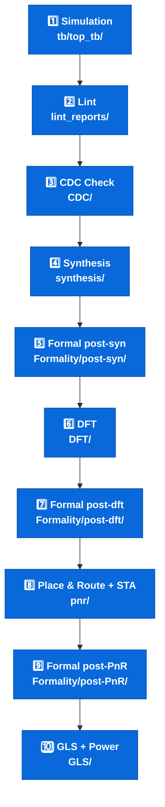
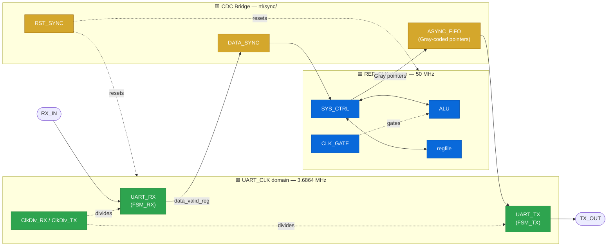
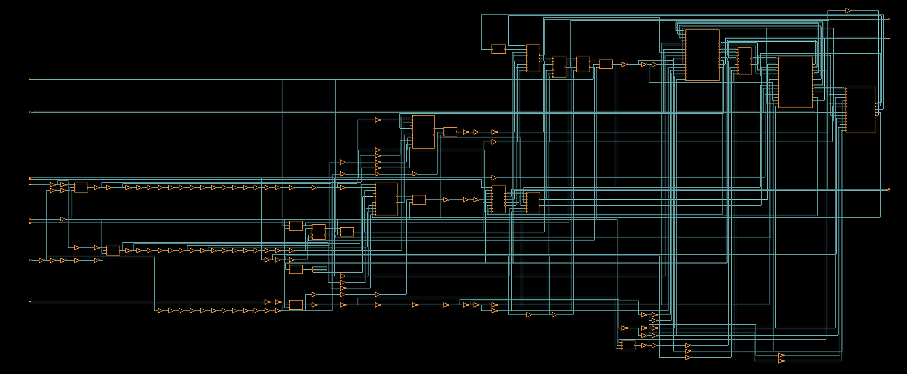
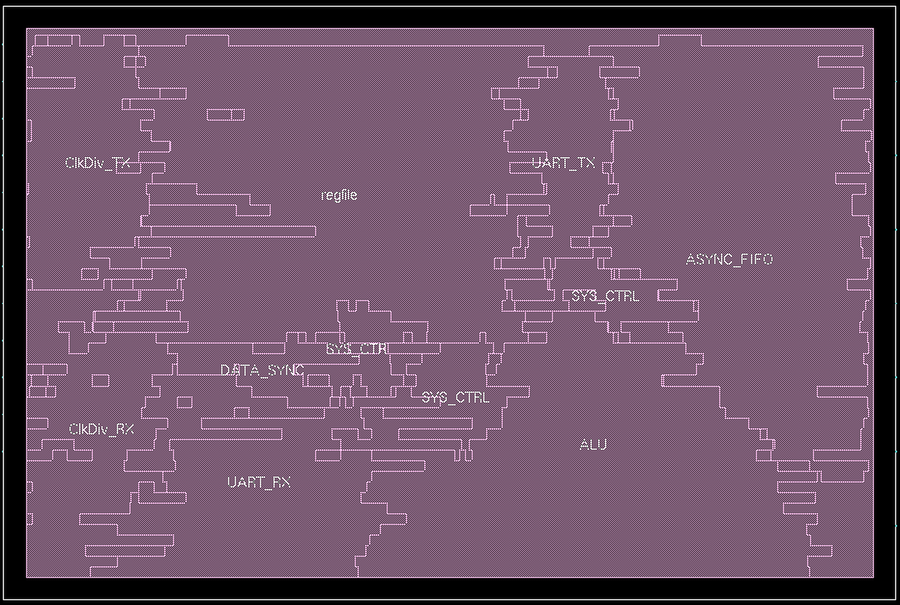
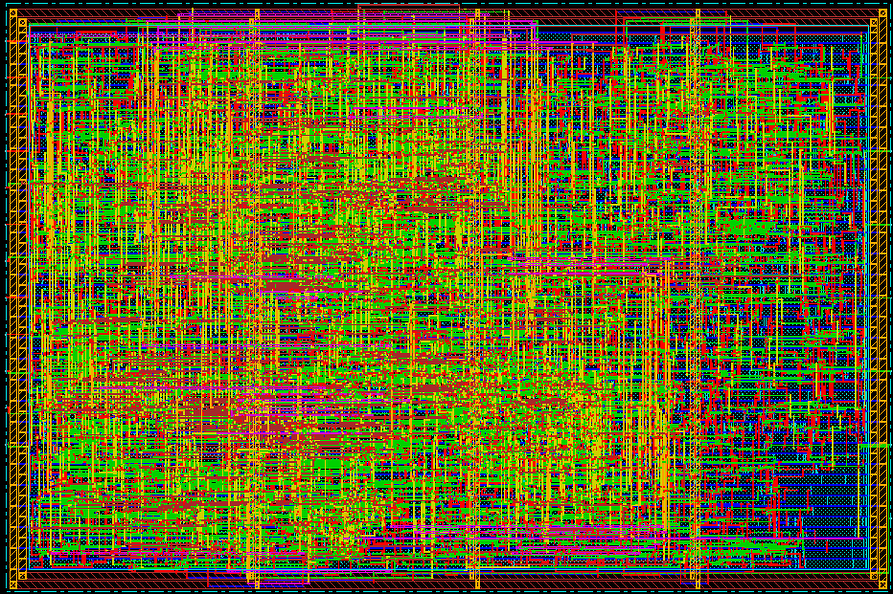

# 🔗 Dual-Clock UART-ALU SoC

<p align="left">
  
  
  
  
  
  
  
  
  
  
  
  
  
</p>

<p align="left">
  
  
</p>

A small SoC that receives commands from a master device over **UART**, executes them using an **ALU** (arithmetic/logic operations) or a **Register File** (read/write), and sends the result back to the master over UART. The design spans **two independent clock domains** bridged by dedicated CDC (Clock Domain Crossing) synchronizers, and is carried in this repository through the full digital ASIC flow — from RTL through synthesis, DFT, formal equivalence, and multi-mode static timing analysis to a placed, clock-treed, routed, and physically verified layout.

### 🧭 Flow Progress


> 🟢 **Done** — RTL → Functional Verification → Lint → CDC Check → Synthesis → Formal (post-syn) → DFT → Formal (post-dft) → Place & Route → Formal (post-PnR) → STA → Physical Verification → GDSII export → Gate-Level Simulation → Power Analysis   🏁 **Flow complete**

<details>
<summary><b>📋 Full status write-up (click to expand)</b></summary>
<br>

The full RTL — both clock domains, all CDC synchronizers, the system controller (`SYS_CTRL`), and the top-level integration (`Final_System`) — is in place, and a self-checking ModelSim testbench (`tb/top_tb/`) has passed its full suite end-to-end: RegFile read/write, three ALU operations, and both UART error-injection paths (parity/framing) — **9/9 checks passing**. `Final_System` has been synthesized with Design Compiler against all three `scmetro_tsmc_cl013g` PVT corners with **no constraint violations** (worst setup slack +0.08 ns, worst hold slack +0.43 ns). RTL static checks (`lint_reports/`) have also been run with Synopsys SpyGlass; the only reported error and both warnings — the intentional `CLK_GATE.v` ICG latch and the two `ClkDiv.v` generated-clock warnings — have formal, justified waivers on file. A dedicated SpyGlass CDC run formally checked every clock-domain crossing: **19 waivers across 4 independent goals, 0 unresolved warnings**, and one real issue it surfaced — an unregistered `data_valid` in `FSM_RX.sv` feeding a CDC synchronizer enable — has been fixed. The post-synthesis netlist has been formally verified against the RTL with Synopsys Formality: **382/382 compare points equivalent, 0 failing, 0 unverified, 0 aborted**. Full-scan DFT has been inserted (4 balanced chains of 94–95 cells, multiplexed flip-flop style, **99.47% estimated stuck-at coverage**, all post-DFT timing met, +14.7% cell area), and a second Formality run confirms the scan-inserted netlist is still functionally equivalent to the DFT-aware RTL in mission mode: **382/382 compare points equivalent, 0 failing, 0 unverified, 0 aborted**. The scan-inserted netlist was then taken through place & route in Cadence First Encounter (die 240.47 × 160.47 µm, 83% placement density, 3 balanced clock trees, 2-step routing with filler insertion). Multi-mode multi-corner timing analysis (functional / scan-shift / scan-capture, each at the slow and fast corners) shows **no setup or hold violations after routing** (setup WNS +3.299 ns, hold WNS +0.067 ns), and the final layout passes geometry (0 violations), connectivity (0 problems), and antenna (0 violations) verification. A third Formality run proves the routed netlist is still equivalent to the DFT-aware RTL (**382/382 compare points, 0 failing**). The routed netlist is then re-simulated at gate level with SDF back-annotation (**9/9 tests passed**), and the resulting switching activity drives a PrimeTime PX power analysis (**0.5695 mW** total). One residual max-transition net is recorded under [Implementation Notes](#implementation-notes).

</details>

### 📚 Table of Contents

- [🚀 Getting Started — Running the Flow](#-getting-started--running-the-flow)
- [System Overview](#system-overview)
- [RTL Structure — Clock Domains Explained](#rtl-structure--clock-domains-explained)
- [Verification (`tb/`)](#verification-tb)
- [Lint (`lint_reports/`)](#lint-lint_reports)
- [CDC — Clock Domain Crossing (`CDC/`)](#cdc--clock-domain-crossing-cdc)
- [Synthesis (`synthesis/`)](#synthesis-synthesis)
- [Formal Verification — RTL vs. Post-Synthesis Netlist](#formal-verification--rtl-vs-post-synthesis-netlist-formalitypost-syn)
- [DFT — Scan Insertion (`DFT/`)](#dft--scan-insertion-dft)
- [Formal Verification — Post-DFT Equivalence](#formal-verification--post-dft-equivalence-formalitypost-dft)
- [Physical Implementation — Place & Route (`pnr/`)](#physical-implementation--place--route-pnr)
- [Formal Verification — Post-PnR Equivalence](#formal-verification--post-pnr-equivalence-formalitypost-pnr)
- [Static Timing Analysis — Multi-Mode Multi-Corner](#static-timing-analysis--multi-mode-multi-corner)
- [Gate-Level Simulation & Power Analysis](#gate-level-simulation--power-analysis-gls)
- [Implementation Notes](#implementation-notes)
- [Technology Library — TSMC13](#technology-library--tsmc13)
- [Status](#status)

## 🚀 Getting Started — Running the Flow

Everyone cloning this repo can reproduce every stage above locally. Each stage is self-contained in its own folder with a shell wrapper script — `cd` in and run it.

### Prerequisites

| Stage | Tool | Tested Version |
|---|---|---|
| Simulation | Mentor/Siemens **ModelSim** | — |
| Lint & CDC | Synopsys **SpyGlass** | `L-2016.06` |
| Synthesis & DFT | Synopsys **Design Compiler** (`dc_shell`) | `O-2018.06-SP1` |
| Formal Verification | Synopsys **Formality** (`fm_shell`) | `L-2016.03-SP1` |
| Place & Route, STA | Cadence **First Encounter / SoC Encounter** (`encounter`) | `08.10-p004_1` |

All tools need valid licenses and to be on your `$PATH`. The target library is `scmetro_tsmc_cl013g` (TSMC13) — set `$LIB_HOME`/tool-specific variables to point at it before running synthesis or DFT.

### Run each stage

| # | Stage | Directory | Command | Key output |
|---|---|---|---|---|
| 1 | 🧪 **Simulation** | `tb/top_tb/` | `vsim -do run.do` (or open ModelSim and `do run.do`) | `logs/simulation_log.txt`, waveform via `wave.do` |
| 2 | 🔍 **Lint** | `lint_reports/` | `spyglass -project lint.prj -batch` | `moresimple.rpt` |
| 3 | ⏱️ **CDC Check** | `CDC/project/` | `spyglass -project system.prj -batch` | Per-goal reports in `../Moresimple/`, waived against `../Waiver/*.awl` |
| 4 | 🏗️ **Synthesis** | `synthesis/scripts/` | `sh run_syn.sh` | `../netlists/`, `../reports/`, `../log/syn.log` |
| 5 | ✅ **Formal (post-syn)** | `Formality/post-syn/scripts/` | `sh run_syn_fm.sh` | `../reports/passing_points.rpt`, `../logs/` |
| 6 | 🧷 **DFT — Scan Insertion** | `DFT/scripts/` | `sh run_dft.sh` | `../netlists/`, `../dft_drc_post_dft/`, `../reports/` |
| 7 | ✅ **Formal (post-dft)** | `Formality/post-dft/scripts/` | `sh run_dft_fm.sh` | `../reports/passing_points.rpt`, `../logs/` |
| 8 | 🗺️ **Place & Route** | `pnr/` | `encounter`, then `source scripts/<step>.tcl` in the order listed [below](#how-to-run) | `netlists/`, `timingReports/`, `clock_report/`, `drcs report/`, `GDS/`, `Final_System.enc.dat/` |
| 9 | ✅ **Formal (post-PnR)** | `Formality/post-PnR/scripts/` | `sh run_pnr_fm.sh` | `../reports/passing_points.rpt`, `../logs/` |
| 10 | ⚡ **GLS + Power** | `GLS/sim/`, then `GLS/pt/` | `vsim -do run.do` (Questa), then `pt_shell -f PT.tcl` | `sim/transcript`, `pt/report/System_pw.rpt`, `pt/pw.log` |

> Each `run_*.sh` wrapper creates its own `reports/`, `log(s)/`, `sdc/`, `sdf/`, and `netlists/` subfolders and pipes the tool's console output straight into a log file with `tee` — so a fresh clone can run any single stage independently and the results land exactly where this README links to them.

### Typical order



## System Overview

| | |
|---|---|
| **Function** | Receive a command frame over UART → decode it in `SYS_CTRL` → execute via `ALU` or `RegFile` → return the result over UART |
| **Reference clock** | `REF_CLK` = 50 MHz |
| **UART clock** | `UART_CLK` = 3.6864 MHz |
| **Clock domains** | 2 (bridged via reset/data synchronizers and an asynchronous FIFO) |
| **Technology** | TSMC 13 (`tsmc13fsg`), Scan Metro standard-cell library (`scmetro_tsmc_cl013g`) |

### Architecture



*Two fully asynchronous clock domains (blue = `REF_CLK`, green = `UART_CLK`) bridged only through the dedicated synchronizers in `rtl/sync/` (yellow) — no signal crosses domains any other way.*

### Post-Synthesis Schematic


*Gate-level block schematic of `Final_System` as synthesized — every RTL block (`UART_RX`, `UART_TX`, `SYS_CTRL`, `regfile`, `ALU`, `ClkDiv_RX`/`ClkDiv_TX`, `CLK_GATE`, `ASYNC_FIFO`, the reset/data synchronizers, etc.) mapped and connected in the netlist. Click the image to zoom in on any signal.*

### Supported ALU Operations
Addition, Subtraction, Multiplication, Division, AND, OR, NAND, NOR, XOR, XNOR, Compare (A = B), Compare (A > B), Compare (A < B), Shift Right (A >> 1), Shift Left (A << 1)

### Supported Register File Operations
Write and Read. Addresses `0x4`–`0x15` are general-purpose data registers; addresses `0x0`–`0x3` are reserved for UART/ALU configuration (parity, prescale, division ratio) and ALU operands.

### Supported UART Command Frames
| Command | Opcode | Frames |
|---|---|---|
| RegFile Write | `0xAA` | 3 (opcode, data, address) |
| RegFile Read | `0xBB` | 2 (opcode, address) |
| ALU Op with operands | `0xCC` | 4 (opcode, operand A, operand B, ALU function) |
| ALU Op without operands | `0xDD` | 2 (opcode, ALU function) |

Full block interfaces, signal tables, and command-frame formats are documented in [`docs/specs/Final_System.pdf`](docs/specs/Final_System.pdf).

## RTL Structure — Clock Domains Explained

The RTL is organized by **clock domain**, so it's immediately clear which clock drives each block and where domain-crossing logic is required.

```
rtl/
├── clock_domain1/      → Driven by REF_CLK (50 MHz)
│   ├── regfile/            8x16 Register File — holds operands, config, and general data
│   ├── alu/                Executes the arithmetic/logic operations
│   ├── clock_gating/       Gates REF_CLK into the ALU (enabled by SYS_CTRL)
│   └── sys_ctrl/           Main controller — decodes commands, drives RegFile/ALU, talks to UART via the synchronizers
│
├── clock_domain2/      → Driven by UART_CLK (3.6864 MHz)
│   ├── uart_tx/             Serializes result frames out to the master (TX_OUT)
│   ├── uart_rx/             Deserializes incoming command frames from the master (RX_IN)
│   ├── pulse_gen/           Converts UART_TX's Busy (level) signal into a single-cycle pulse
│   └── clock_divider/       Generates the bit-rate clock for TX/RX from UART_CLK (two instances, one per interface)
│
├── sync/                → Clock Domain Crossing (CDC) logic between domain 1 and domain 2
│   ├── rst_sync/             Active-low async reset synchronizer (one instance per domain)
│   ├── data_sync/             Synchronizes UART_RX's parallel output data into the REF_CLK domain
│   └── async_fifo/            Dual-clock FIFO carrying TX data from REF_CLK (write side) to UART_CLK (read side)
│
└── top/                  Top-level integration of both clock domains and all synchronizers
```

**Why two domains?** The core datapath (RegFile + ALU) runs at the fast 50 MHz reference clock for quick command execution, while the UART interface runs at the much slower 3.6864 MHz clock required for standard UART bit timing. The `sync/` blocks are what safely move resets, data, and control pulses between these two asynchronous clocks.

### RegFile (`rtl/clock_domain1/regfile/`)

| File | Role |
|---|---|
| `Register_File.v` | 8-bit × 16-entry register file (`regfile`, parameterized `Address_width`, `Data_width`, `depth`). Single-cycle synchronous read/write (`RdEN`/`WrEn`), with `RdData_Valid` pulsing high the cycle after a read. On reset, all entries clear to 0 except the reserved configuration registers: `Reg_file[2]` (UART config: parity enable/type + prescale) resets to `8'b1000_0001`, and `Reg_file[3]` (clock-divider ratio) resets to `8'b0010_0000` (32). Continuously exposes `REG0`–`REG3` (ALU operand A/B, UART config, division ratio) to their consumer blocks. |

### ALU (`rtl/clock_domain1/alu/`)

| File | Role |
|---|---|
| `ALU.v` | Arithmetic/logic unit (`ALU`, parameterized `OPER_WIDTH`, output width = 2×`OPER_WIDTH`). Registers `ALU_OUT`/`OUT_VALID` on `CLK` when `EN` is asserted, decoding `ALU_FUN` to select the operation: Add, Sub, Mul, Div, AND, OR, NAND, NOR, XOR, XNOR, Compare (A=B), Compare (A>B), Compare (A<B), Shift Right (A>>1), Shift Left (A<<1). Synchronous reset clears the output and valid flag. |

### Clock Gating (`rtl/clock_domain1/clock_gating/`)

| File | Role |
|---|---|
| `CLK_GATE.v` | Integrated clock gating cell (`CLK_GATE`). A level-sensitive latch captures `CLK_EN` while `CLK` is low, and the latched enable is ANDed with `CLK` to produce a glitch-free `GATED_CLK`. This is the standard ICG (Integrated Clock Gating) structure used to gate `REF_CLK` into the ALU, driven by `SYS_CTRL`. A commented-out instantiation of the technology's `TLATNCAX12M` cell is included for mapping to the standard-cell library during synthesis. |

### SYS_CTRL (`rtl/clock_domain1/sys_ctrl/`)

| File | Role |
|---|---|
| `SYS_CTRL.sv` | Main command controller (`SYS_CTRL`, parameterized `OPER_WIDTH`, `ALU_OUT_WIDTH`, `Address_width`). A Moore/Mealy FSM decodes the opcode byte received from UART_RX (`0xAA`/`0xBB`/`0xCC`/`0xDD`) and sequences RegFile writes/reads and ALU operations accordingly, sending the result back out through the TX path once `FIFO_FULL` allows it. Verified against RegFile read/write and three ALU operations in `tb/top_tb/` — see [Latest Simulation Result](#latest-simulation-result-). |

### UART_TX (`rtl/clock_domain2/uart_tx/`)

| File | Role |
|---|---|
| `UART_TX.v` | Top-level UART transmitter — integrates the FSM, MUX, parity, and serializer sub-blocks |
| `FSM_TX.sv` | Transmit control state machine (idle → start → data → parity → stop) |
| `MUX.v` | Selects between data bit, start bit, parity bit, and stop bit for the serial line |
| `Parity_calc.v` | Computes the parity bit for the outgoing frame |
| `serializer.v` | Shifts the parallel input data out bit-by-bit onto `TX_OUT`. Both `ser_data` (the serial output bit) and `ser_done` (end-of-byte flag) are registered on `CLK`, avoiding combinational glitches on the serial line. |

### UART_RX (`rtl/clock_domain2/uart_rx/`)

| File | Role |
|---|---|
| `UART_RX.v` | Top-level UART receiver — integrates the FSM, sampling, and checker sub-blocks |
| `FSM_RX.sv` | Receive control state machine (idle → start → data → parity → stop) |
| `strt_check.v` | Detects and validates the start bit on `RX_IN` |
| `data_sampling.v` | Samples incoming serial bits at the prescaled bit-rate clock |
| `deserializer.v` | Shifts sampled serial bits into a parallel data word |
| `edge_bit_counter.v` | Tracks bit position / oversampling count within each received bit |
| `parity_check.v` | Checks received parity against the configured parity type |
| `stop_check.v` | Validates the stop bit and flags framing errors |

### PULSE_GEN (`rtl/clock_domain2/pulse_gen/`)

| File | Role |
|---|---|
| `PULSE_GEN.v` | Level-to-pulse converter (`PULSE_GEN`). Delays `LVL_SIG` by one clock cycle and generates a single-cycle `PULSE_SIG` on its rising edge (rising-edge detector). Used to turn UART_TX's `Busy` level signal into a one-cycle read-enable pulse for the ASYNC_FIFO. Asynchronous, active-low reset. |

### Clock Divider (`rtl/clock_domain2/clock_divider/`)

| File | Role |
|---|---|
| `ClkDiv.v` | Programmable clock divider (`ClkDiv`). Divides `i_ref_clk` by `i_div_ratio` to produce `o_div_clk`, handling both even and odd division ratios (dual positive/negative-edge counters combined for odd ratios). Passes the reference clock through unchanged when `i_clk_en` is low or the ratio is 0/1. Asynchronous, active-low reset (`i_rst_n`). |
| `Clk_Div_Mux.v` | Prescale-to-division-ratio decoder (`Clk_Div_Mux`). Maps the 6-bit `prescale` configuration value (from RegFile) to the 4-bit `Div_Ratio` fed into `ClkDiv`. |

### RST_SYNC (`rtl/sync/rst_sync/`)

| File | Role |
|---|---|
| `RST_SYNC.v` | Asynchronous-assert, synchronous-release reset synchronizer (`RST_SYNC`, parameterized `NUM_STAGES`). Asserts `SYNC_RST` immediately when `RST` goes low, and releases it synchronously with `CLK` through a multi-flip-flop chain, avoiding metastability on reset de-assertion. One instance is used per clock domain (`RST_SYNC_1` for REF_CLK, `RST_SYNC_2` for UART_CLK). |

### Data_Sync (`rtl/sync/data_sync/`)

| File | Role |
|---|---|
| `Data_Sync.v` | Multi-bit CDC synchronizer (`DATA_SYNC`, parameterized `BUS_WIDTH`/`NUM_STAGES`). Uses a multi-flip-flop synchronizer chain to detect a `bus_enable` pulse on the destination clock (`CLK`), captures `unsync_bus` into `sync_bus` once the pulse is detected, and issues a one-cycle `enable_pulse` marking the new data as valid. Reset is asynchronous, active-low. |

### ASYNC_FIFO (`rtl/sync/async_fifo/`)

| File | Role |
|---|---|
| `ASYNC_FIFO.v` | Top-level dual-clock FIFO (`ASYNC_FIFO`). Integrates the memory, pointer, and Gray-code synchronizer sub-modules below to safely move write-side data (REF_CLK domain) to the read side (UART_CLK domain). |
| `FIFO_MEM_CNTRL.v` | Dual-port memory array. Writes `W_data` on `W_CLK` when enabled and not full; continuously outputs `R_data` from `R_addr`. |
| `FIFO_wptr.v` | Write-pointer logic. Increments the write address on `W_CLK`, converts it to Gray code, and generates the `W_full` flag by comparing against the synchronized read pointer. |
| `FIFO_rptr.v` | Read-pointer logic. Increments the read address on `R_CLK`, converts it to Gray code, and generates the `R_empty` flag by comparing against the synchronized write pointer. |
| `DF_SYNC.v` | Generic multi-bit Gray-code pointer synchronizer (`DF_SYNC`, parameterized `data_width`/`NUM_STAGES`). Used twice inside `ASYNC_FIFO` to cross the write pointer into the read clock domain and vice versa. |

### Top Level (`rtl/top/`)

| File | Role |
|---|---|
| `Final_System.v` | Top-level integration (`Final_System`, parameterized `BUS_WIDTH`, `NUM_STAGES`, `Address_width`, `memory_depth`, `FIFO_depth`). Instantiates both reset synchronizers, `UART_RX`, `Data_Sync`, `SYS_CTRL`, `RegFile`, `ALU`, `Clock Gating`, `ASYNC_FIFO`, `PULSE_GEN`, `Clock Divider`, and `UART_TX`, wiring the full command → execute → response datapath across both clock domains. |
| `NOT.v` | Simple inverter utility module used inside the top-level wiring. |

## Verification (`tb/`)

A self-checking, **ModelSim**-based top-level testbench, driving `Final_System` directly over the UART command protocol and scoring itself against expected results.

```
tb/
└── top_tb/
    ├── system_tb.sv    Self-checking testbench for Final_System
    ├── run.do           ModelSim compile + simulate script
    ├── wave.do           Full waveform layout (every internal signal, for debug)
    ├── wave_reduced.do    Curated 7-group waveform layout (clocks, UART pins, FSM, RegFile, ALU, TX flow, error flags) used for the report below, with quick-zoom macros (`c1`…`c6`) for each test window
    ├── filelist.f         Explicit RTL + testbench file list for `vlog -f filelist.f`, as an alternative to globbing `*.*v`
    └── logs/
        └── simulation_log.txt   Transcript from the latest passing ModelSim run
```

**`system_tb.sv`** drives `Final_System` with realistic clocks (`REF_CLK` = 50 MHz, `UART_CLK` = 3.6864 MHz) and a UART-accurate bit period, then exercises:

| Test | Scenario | Checks |
|---|---|---|
| 1 | RegFile Write (`0xAA`) then Read (`0xBB`) at address `0x04` | Read-back data matches what was written |
| 2 | ALU with operands (`0xCC`): `10 + 5` | Result low/high bytes returned over TX match `0x000F` |
| 3 | ALU without operands (`0xDD`): `10 − 5` | Result matches `0x0005` |
| 4 | ALU without operands (`0xDD`): `10 × 5` | Result matches `0x0032` |
| 5 | Corrupted-parity frame injected on `RX_IN` | `parity_error` flag asserts |
| 6 | Corrupted stop-bit frame injected on `RX_IN` | `stop_error` flag asserts |

A running `pass_count` / `fail_count` is printed as each check completes, with a final `TEST SUMMARY` at the end of the run.

**To run:** open ModelSim in `tb/top_tb/`, then:
```tcl
do run.do
```
This compiles all RTL sources, elaborates `system_tb`, loads the `wave.do` waveform layout, and runs the simulation to completion.

### Latest Simulation Result ✅

The full test suite has been run end-to-end on ModelSim with **all 9 checks passing**:

```
TEST SUMMARY: PASSED = 9 | FAILED = 0
>>> SUCCESS: ALL ADVANCED TESTS PASSED SUCCESSFULLY! <<<
```

| # | Check | Result | Time |
|---|---|---|---|
| 1 | RegFile read-back = `0x55` | ✅ PASS | 599,912 ns |
| 2 | ALU ADD (10+5) low byte = `0x0F` | ✅ PASS | 1,094,703 ns |
| 3 | ALU ADD (10+5) high byte = `0x00` | ✅ PASS | 1,198,869 ns |
| 4 | ALU SUB (10−5) low byte = `0x05` | ✅ PASS | 1,502,688 ns |
| 5 | ALU SUB (10−5) high byte = `0x00` | ✅ PASS | 1,606,855 ns |
| 6 | ALU MUL (10×5) low byte = `0x32` | ✅ PASS | 1,910,674 ns |
| 7 | ALU MUL (10×5) high byte = `0x00` | ✅ PASS | 2,014,840 ns |
| 8 | Parity error correctly flagged | ✅ PASS | 2,115,331 ns |
| 9 | Framing (stop-bit) error correctly flagged | ✅ PASS | 2,235,822 ns |

Full transcript: [`tb/top_tb/logs/simulation_log.txt`](tb/top_tb/logs/simulation_log.txt).

> **Note:** the logged transcript above was captured while `REF_period` was set for a 100 MHz reference clock; `REF_period` has since been corrected to 50 MHz. The waveform report below is from a fresh run at the corrected 50 MHz period (frame timing throughout it — e.g. ~96 µs per UART frame — matches the 50 MHz / 3.6864 MHz spec), so it supersedes this note's concern. A refreshed `simulation_log.txt` transcript at 50 MHz is still queued to replace the one above.

### 📄 Visual Waveform Report

[`docs/verification/System_Waveform_Report.pdf`](docs/verification/System_Waveform_Report.pdf) is a designed, waveform-annotated walkthrough of all 6 scenarios above — one spread per test, each with the command/response frame breakdown, the exact FSM path taken (states read directly from `SYS_CTRL.sv` / `FSM_RX.sv`, including the short `wait_*`/`send_*`/`check` states that are too brief to label on the waveform itself), a decoded bit-level UART frame, a verification checklist, and a timestamped event timeline. Tests 5 and 6 additionally document the `UART_RX`/`FSM_RX` rejection path for a corrupted-parity and a corrupted-stop-bit frame respectively, including the testbench's own `[PASS]` self-check print. Generated with the `wave_reduced.do` layout above.

## Lint (`lint_reports/`)

RTL static checks were run with **Synopsys SpyGlass** (`SpyGlass_vL-2016.06`), using the `lint/lint_rtl` goal from the `rtl_handoff` GuideWare methodology. Every reported issue has a formal, justified waiver.

```
lint_reports/
├── lint.prj                        SpyGlass project file — lists every RTL source, lint options, goal setup, and the waiver file to apply
├── moresimple.rpt                   SpyGlass lint report (clock-reset, ERC, latch, lint, morelint, STARC, timing, and related rule groups)
└── spyglass-1_waiver_file.awl       Waiver file with a written engineering justification for each waived message
```

### Result Summary

| Severity | Count | Details | Waived |
|---|---|---|---|
| Error | 1 | `InferLatch` — latch inferred for `Latch_Out` in `CLK_GATE.v` | ✅ |
| Warning | 2 | `STARC05-1.4.3.4 ClkSigToNonClkPin` — `ClkDiv`'s `clk_div` output used as a non-clock signal in both TX and RX clock-divider instances | ✅ |
| Info | 2 | Top-level design unit detection (`Final_System`) and elaboration summary pointer | — (informational) |

> The raw `moresimple.rpt` in this snapshot predates loading the waiver file into the SpyGlass session, so it still lists the error/warnings as reported. `lint.prj` points SpyGlass at `spyglass-1_waiver_file.awl` as its `default_waiver_file`; re-running the goal with the waiver file loaded suppresses all 3 messages below, leaving only the 2 informational messages.

**Waiver 1 — `InferLatch` in `CLK_GATE.v`:** the inferred latch is a deliberate Integrated Clock Gating (ICG) implementation, not an unintended combinational latch. It captures `CLK_EN` while `CLK` is low and holds it stable through the clock's high phase, so `GATED_CLK = CLK && Latch_Out` is generated glitch-free — the standard RTL pattern for clock gating ahead of synthesis mapping onto a technology ICG cell (`TLATNCAX12M`, already referenced in `CLK_GATE.v`). Action required at synthesis: confirm `set_clock_gating_style -positive_edge_logic integrated` correctly maps this construct onto the library ICG cell rather than leaving a literal latch in the netlist.

**Waiver 2 — `STARC05-1.4.3.4` in `ClkDiv.v` (×2, TX and RX instances):** `clk_div` is a generated (internally divided) clock, flagged because it drives clock ports (`CLK_RX`/`CLK_TX`) downstream. Inside the divider module it is legitimately combined through synchronous reset logic and a combinational selector (`clk_en ? div_clk : i_ref_clk`) to implement ratio-based division and the reference-clock bypass path — inherent to how a clock-divider/clock-mux block works, not a design defect. No action required.

Full detail is in [`lint_reports/moresimple.rpt`](lint_reports/moresimple.rpt) (raw report) and [`lint_reports/spyglass-1_waiver_file.awl`](lint_reports/spyglass-1_waiver_file.awl) (waiver justifications).

## CDC — Clock Domain Crossing (`CDC/`)

A dedicated **SpyGlass CDC** run — separate from the `lint_rtl` goal above — formally checks every clock-domain crossing in the design, using the `rtl_handoff` GuideWare methodology, broken out into **4 independent goals** so setup, structural, and functional CDC checks are each tracked (and waived) on their own terms:

```
CDC/
├── project/
│   └── system.prj                   SpyGlass project file — RTL file list, methodology, and the 4 goals below
├── scripts/
│   ├── Final_System.sgdc            SGDC constraints: clock/reset definitions, quasi-static signals, FIFO & synchronizer declarations
│   ├── Final_System.sdc              Synthesis SDC consumed by sdc2sgdc translation
│   └── sdc2sgdc.sgdc.5707             Tool-generated clock summary, translated from the SDC
├── Waiver/                           One waiver file per goal, each a written engineering justification
│   ├── cdc_setup_goal_waiver.awl
│   ├── clock_reset_integrity_waiver.awl
│   ├── cdc_verify_struct_waiver.awl
│   └── cdc_verify_goal_waiver.awl
└── Moresimple/                       Raw per-goal SpyGlass reports
    ├── cdc_setup.rpt
    ├── clock_reset_integrity.rpt
    ├── cdc_verify_struct.rpt
    └── cdc_verify.rpt
```

### Clock domains detected

| Clock | Period | Source |
|---|---|---|
| `REF_CLK` | 20 ns (50 MHz) | Primary input |
| `UART_CLK` | 271.30 ns (~3.69 MHz) | Primary input |
| `Final_System.CLK_GATE.GATED_CLK` (`ALU_CLK`) | 20 ns | Generated — gated `REF_CLK` |
| `Final_System.ClkDiv_TX.o_div_clk` (`TX_CLK`) | 8681.50 ns | Generated — divided `UART_CLK` |
| `Final_System.ClkDiv_RX.o_div_clk` (`RX_CLK`) | 271.30 ns | Generated — divided `UART_CLK` |

### SGDC improvements — structural fixes, not just waivers

Two additions to `Final_System.sgdc` resolved issues at the source instead of only suppressing the message:

- **`fifo -memory "Final_System.ASYNC_FIFO.FIFO_MEM_CNTRL.mem"`** — explicitly declares the async-FIFO's memory array as a FIFO structure, so SpyGlass understands the read-empty/write-full handshaking around it natively instead of treating every bit of the memory bus as an ordinary, unprotected crossing.
- **`cdc_attribute -unrelated`** (×2) — declares `DATA_SYNC`'s synchronizer flop structurally unrelated to the FIFO's `DF_SYNC_W`/`DF_SYNC_R` synchronizer flops, formally capturing that these are independent crossings that happen to converge on the same downstream MUX in mutually exclusive FSM states, rather than leaving the tool to flag it as an ambiguous convergence.

`REG2`/`REG3` (UART config and clock-divider ratio) remain declared `quasi_static` rather than `set_case_analysis`, for the same reason as before: they change at configuration time, not while the clock they configure is toggling, so modeling them as slow-changing is correct where tying them to one fixed value would not be.

### Result — 4 goals run independently, 19 waivers, 0 unresolved warnings ✅

| Goal | Messages | Waived | Reported | Severity of reported messages |
|---|---|---|---|---|
| `cdc/cdc_setup_check` | 15 | 2 | 13 | All **Info** |
| `cdc/clock_reset_integrity` | 14 | 4 | 10 | All **Info** |
| `cdc/cdc_verify_struct` | 48 | 3 | 45 | All **Info** |
| `cdc/cdc_verify` | 59 | 10 | 49 | All **Info** |

Every message left after waiving is **Info-level** — synchronizer structures and crossings that SpyGlass examined and explicitly confirmed (`Synchronized Crossing: ... PASSED`, `by method: Conventional multi-flop...`, `does not require synchronization (long-delay/quasi-static)`, etc.). **Zero outstanding Warnings.**

| Rule | Waived | What it flags | Why it's safe |
|---|---|---|---|
| `Setup_port01` | `RST` port not fully constrained at top level | Drives dedicated reset synchronizers (`RST_SYNC`) immediately |
| `Clock_check04` | `negedge UART_CLK` used against recommended edge | Intentional — needed for 50% duty cycle in the odd-ratio clock divider |
| `Clock_converge01` | `UART_CLK` fan-out reconverges on `CLK_RX` | Intentional reconvergence via OR gate in the odd-divider architecture (bypass path + divided path) |
| `Clock_glitch04` | Divider logic (`clk_div`/`clk_odd_div`) reconverges on destination registers (`R_addr`, `current_state`) | Structural artifact of the same posedge/negedge OR-gate divider, present in both TX and RX instances |
| `Ac_conv04` | FIFO memory bus converges into the UART TX serializer's shift register (several bit-ranges) | Protected by `R_empty` read-handshaking, so Gray-encoding isn't required on the data bus itself |
| `Ac_cdc01a` | Fast-to-slow crossing for each bit of the FIFO's Gray write pointer into `DF_SYNC_R` | Gray coding guarantees no intermediate/invalid states are sampled across the crossing |
| `Ac_datahold01a` | FIFO read-payload crossing into `Parity_calc`/`serializer` not independently data-hold-checked | Structurally protected by the FIFO's read-empty handshaking |

Full per-goal justifications are in [`CDC/Waiver/`](CDC/Waiver/); raw tool output is in [`CDC/Moresimple/`](CDC/Moresimple/).

### Fix landed from this CDC pass — `FSM_RX.sv`: registering `data_valid`

The CDC run's `Ac_datahold01a`-style analysis around `UART_RX`'s handoff to `DATA_SYNC` surfaced a real issue (not a false positive to waive): `data_valid` in `FSM_RX.sv` was driven directly out of the FSM's combinational next-state/output block, then used, unregistered, as `DATA_SYNC`'s `bus_enable` — the enable that qualifies a CDC synchronizer sampled on `REF_CLK`. A combinational signal feeding a synchronizer enable can glitch mid-cycle and be sampled incorrectly on the other side of the clock boundary.

**Fix:** `data_valid` is now a clean, clocked flip-flop output. The combinational logic still computes the value (renamed `data_valid_comb`), but it's registered on `posedge CLK` (asynchronous `RST`) before leaving the module, giving `DATA_SYNC` a single, clock-aligned pulse to synchronize instead of a combinational signal.

## Synthesis (`synthesis/`)

`Final_System` has been synthesized with **Synopsys Design Compiler** (`O-2018.06-SP1`) against all three `scmetro_tsmc_cl013g` PVT corners, using multi-corner timing (worst-case `ss_1p08v_125c` for setup, best-case `ff_1p32v_m40c` for hold).

```
synthesis/
├── scripts/
│   ├── syn_script.tcl    Design Compiler synthesis script (libraries, RTL elaboration, constraints, mapping, reporting)
│   ├── cons.tcl           Timing/design constraints applied before mapping
│   ├── system.lst          List of RTL source files read into the synthesis session
│   └── run_syn.sh          Shell wrapper to launch the synthesis run
├── sdc/
│   └── Final_System.sdc    Synthesis-derived SDC: clocks, uncertainty, I/O delays, clock groups
├── netlist/
│   ├── Final_System.v       Gate-level structural netlist
│   └── Final_System.ddc     Compiled Design Compiler database (netlist + constraints)
├── sdf/
│   └── Final_System.sdf     Standard Delay Format — back-annotated cell/net delays for gate-level simulation
├── svf/
│   └── Final_System.svf     Setup Verification File for Formality (RTL-vs-netlist equivalence checking)
├── log/
│   └── syn.log               Full synthesis session transcript
└── reports/
    ├── area.rpt               Cell/area breakdown, by hierarchy
    ├── power.rpt               Power breakdown, by hierarchy
    ├── setup.rpt               Worst setup (max-delay) timing path
    ├── hold.rpt                 Worst hold (min-delay) timing path
    ├── clocks.rpt                Clock tree summary (real + generated clocks)
    └── constraints.rpt            Constraint-violation summary
```

### Clock Tree

Design Compiler derived 3 generated clocks from the two real (unconstrained) input clocks, matching the RTL's clock-gating and clock-dividing structure:

| Clock | Period | Source | Divide |
|---|---|---|---|
| `REF_CLK` | 20.00 ns (50 MHz) | Primary input | — |
| `ALU_CLK` | 20.00 ns (50 MHz) | `CLK_GATE/GATED_CLK` (generated from `REF_CLK`) | ÷1 |
| `UART_CLK` | 271.30 ns (3.6864 MHz) | Primary input | — |
| `RX_CLK` | 271.30 ns | `ClkDiv_RX/o_div_clk` (generated from `UART_CLK`) | ÷1 |
| `TX_CLK` | 8,681.50 ns | `ClkDiv_TX/o_div_clk` (generated from `UART_CLK`) | ÷32 |

`REF_CLK`/`ALU_CLK` and `UART_CLK`/`TX_CLK`/`RX_CLK` are constrained as asynchronous clock groups, consistent with the CDC synchronizers in `rtl/sync/`.

### Timing — Constraints Met ✅

```
This design has no violated constraints.
```

| Check | Corner | Worst Path | Slack | Result |
|---|---|---|---|---|
| Setup (max delay) | `ss_1p08v_125c` (worst-case) | `regfile → ALU` (`ALU_CLK`) | **+0.08 ns** | ✅ MET |
| Hold (min delay) | `ff_1p32v_m40c` (best-case) | `DF_SYNC_W` (`REF_CLK`) / `RST_SYNC_2` (`UART_CLK`) | **+0.43 ns** | ✅ MET |

Per-clock-group worst setup slack: `ALU_CLK` +0.08 ns · `REF_CLK` +11.36 ns · `RX_CLK` +212.79 ns · `UART_CLK` +265.57 ns · `TX_CLK` +6,942.23 ns. The 50 MHz `regfile → ALU` path is the critical one — every other domain has large margin.

### Area & Power

| Metric | Value |
|---|---|
| Total cell area | 24,916.62 µm² |
| Total area (incl. net interconnect) | 295,117.99 µm² |
| Cell count | 2,196 (1,739 combinational, 415 sequential) |
| Total power | 0.255 mW |

By hierarchy, the largest power contributors are `regfile` (42.7%), `ASYNC_FIFO` (26.7%), and `ALU` (6.9%) — dominated by leakage at this analysis effort (`-analysis_effort low`), so these figures should be treated as a first-pass estimate rather than a signoff-quality power number.

### Synthesis Log

`syn.log` reports **0 errors, 44 warnings**. All warnings are benign/expected for this design stage — mainly unused/dangling internal signals flagged by lint-style checks (e.g. floating counter bits in `edge_bit_counter`, an unconnected `prescale[0]` bit in `data_sampling`), plus the standard `SYNOPSYS_UNCONNECTED_*` net-naming note from the Verilog netlist writer. None affect functionality or timing closure.

## Formal Verification — RTL vs. Post-Synthesis Netlist (`Formality/post-syn/`)

The gate-level netlist produced by Design Compiler is proven logically equivalent to the RTL using **Synopsys Formality** (`L-2016.03-SP1`), consuming the SVF (Setup Verification File) that Design Compiler wrote out during synthesis (`synthesis/svf/Final_System.svf`) so that the reference-to-implementation mapping matches what the synthesis tool actually did.

```
Formality/
└── post-syn/
    ├── scripts/
    │   ├── syn_fm_script.tcl   Formality session: reads RTL (Ref) + netlist (Imp), reads the SVF, matches, verifies
    │   └── run_syn_fm.sh        Shell wrapper to launch fm_shell in batch mode
    ├── logs/
    │   └── syn_fm.log            Full Formality session transcript
    ├── formality_svf/
    │   └── svf.txt                 Copy of the consumed SVF, for traceability
    └── reports/
        ├── passing_points.rpt      Matched, logically-equivalent compare points
        ├── failing_points.rpt        Not-equivalent compare points
        ├── unverified_points.rpt      Compare points Formality could not resolve
        └── aborted_points.rpt          Compare points dropped from analysis
```

### Result — Verification SUCCEEDED ✅

| Compare Points | Port | DFF | LAT | Total |
|---|---|---|---|---|
| Passing (equivalent) | 3 | 378 | 1 | **382** |
| Failing (not equivalent) | 0 | 0 | 0 | **0** |
| Unverified | — | — | — | **0** |
| Aborted | — | — | — | **0** |

Formality ran in **Synopsys Auto Setup** mode (`synopsys_auto_setup = true`), matching the RTL-interpretation and undriven-signal settings Design Compiler itself uses, so the equivalence check is apples-to-apples with how the netlist was actually synthesized. One `FMR_ELAB-147` message was produced while linking the reference (RTL) design — an interpretation note, not an equivalence failure — and does not appear against any of the 382 matched points. (Re-run after the `FSM_RX.sv` `data_valid` register fix — see [CDC](#cdc--clock-domain-crossing-cdc) — which added one DFF, hence 382 vs. the earlier 381.)

Full detail is in [`Formality/post-syn/logs/syn_fm.log`](Formality/post-syn/logs/syn_fm.log) (session transcript) and the individual `reports/*.rpt` files.

## DFT — Scan Insertion (`DFT/`)

Design-for-Test is added to `Final_System_dft` using Design Compiler's scan-architecting flow: **full scan, multiplexed flip-flop style**, a single external scan-enable (`SE`), a dedicated scan clock, and no scan compression. The DFT build re-elaborates the design from the test-friendly RTL variants (`rtl/top__dft/`), re-applies the synthesis constraints, runs `compile -scan`, and then stitches the chains with `insert_dft`.

```
DFT/
├── scripts/
│   ├── dft_script.tcl          DC session: elaborate → constrain → compile -scan → define DFT signals → DRC → insert_dft → incremental compile → post-DFT DRC/reports
│   ├── cons.tcl                   Timing/design constraints (synthesis constraints + scan-clock section)
│   ├── run_dft.sh                  Shell wrapper to launch dc_shell
│   └── system.lst                    RTL file list (DFT-friendly variants)
├── log/
│   └── dft.log                        Full DC session transcript
├── dft_drc_post_dft/
│   └── dft_drc_post_dft.rpt              Post-DFT design-rule check + estimated fault coverage
├── netlists/
│   ├── Final_System_dft.v                  Scan-inserted gate-level netlist
│   └── Final_System_dft.ddc                  Compiled DC database
├── reports/                                  area / power / setup / hold / clocks / ports / constraints
├── sdc/                                         Post-DFT constraints: mission-mode `Final_System_dft.sdc` plus the per-mode files used by place & route —
│                                                 `_func.sdc` (test_mode=0, SE=0), `_scan.sdc` (test_mode=1, SE=1), `_capture.sdc` (test_mode=1, SE=0)
├── sdf/                                         Post-DFT delay annotation
└── svf/
    └── Final_System_dft.svf                Setup file for the follow-up Formality equivalence check
```

### Block Diagram — `Final_System_dft` Top-Level Ports


*Top-level symbol for the DFT-inserted design, showing the functional ports (`RX_IN`, `REF_CLK`, `UART_CLK`, `RST`, `TX_OUT`, `parity_error`, `stop_error`) alongside the scan/test ports added for DFT (`scan_CLK`, `scan_RST`, `test_mode`, `SE`, and the 4-bit `SI[]`/`SO[]` scan chain buses).*

### RTL made test-friendly

Two blocks needed a DFT-aware variant, added alongside the originals rather than replacing them:

- **`CLK_GATE_dft.v`** — adds a `TE` (test-enable) input, ORed with `CLK_EN`, so the integrated clock-gating latch is forced transparent in test mode instead of gating the scan clock.
- **`ClkDiv_dft.v`** — splits the divider's single dual-edge-triggered clock (`i_ref_clk`, used on both `posedge` and `negedge`) into two separate ports, `i_ref_clk_pos` and `i_ref_clk_neg`. ATPG tools can't drive a single physical clock pin on both edges during scan shift, so the two edges are exposed as independent inputs and merged back in test glue logic (`MUX2x1.v`) — a new top-level variant, `Final_System_dft.v` (`rtl/top__dft/`), wires this all together and adds the scan/test ports (`scan_CLK`, `scan_RST`, `test_mode`, `SE`, `SI[3:0]`, `SO[3:0]`).

### DFT signal specification

| Port | DFT type | Notes |
|---|---|---|
| `scan_CLK` | `ScanClock` | Test clock, timing `{500 1000}` ns (1 MHz); constrained as `DFTCLK` with 200 ns I/O delays on the scan ports |
| `scan_RST` | `Reset` | Active-low, existing in the design |
| `test_mode` | `Constant` + `TestMode` | Active-high; selects the test clock/reset path |
| `SE` | `ScanEnable` | Active-high scan enable, no hookup pin (routed to all scan muxes) |
| `SI[3:0]` / `SO[3:0]` | `ScanDataIn` / `ScanDataOut` | One port pair per chain |

`set_scan_configuration -max_length 100` caps chain length; after `insert_dft`, `test_mode` is tied to 0 with `set_case_analysis` before the netlist, SDC, and SDF are written, so the exported constraints describe mission mode.

### Result — 4 balanced scan chains, 99.47% estimated coverage, timing clean ✅

| | |
|---|---|
| Scan methodology | Full scan, multiplexed flip-flop, clock domain `no_mix` |
| Chains | **4** — 95 / 95 / 94 / 94 cells, **378 scan cells** total |
| Post-DFT DRC | **1** violation — `CLK_GATE/U0_TLATNCAX12M` reports constant-1 (`TEST-505`); expected and consistent with the ICG latch already waived in [Lint](#lint-lint_reports) |
| Estimated stuck-at coverage | **99.47%** |
| Post-DFT timing | No violated constraints — worst setup slack +0.09 ns, worst hold slack +0.47 ns |

| Chain | Scan in → out | Cells |
|---|---|---|
| S1 | `SI[3]` → `SO[3]` | 95 |
| S2 | `SI[2]` → `SO[2]` | 95 |
| S3 | `SI[1]` → `SO[1]` | 94 |
| S4 | `SI[0]` → `SO[0]` | 94 |

| Fault class (uncollapsed stuck-at) | Code | # Faults |
|---|---|---|
| Detected | DT | 17,422 |
| Possibly detected | PT | 1 |
| Undetectable | UD | 758 |
| ATPG untestable | AU | 79 |
| Not detected | ND | 14 |
| **Total** | | **18,274** |
| **Test coverage** | | **99.47%** |

The coverage figure comes from `dft_drc -coverage_estimate`, a Design Compiler estimate (no ATPG pattern generation was run) — see the note in [`dft_drc_post_dft.rpt`](DFT/dft_drc_post_dft/dft_drc_post_dft.rpt). Full detail is in [`DFT/log/dft.log`](DFT/log/dft.log) (0 errors, 62 warnings; the DRC warning above plus informational multi-clock notes such as `TIM-099`).

**Post-DFT timing (worst path per clock group):**

| Clock group | Worst setup slack | Worst hold slack |
|---|---|---|
| `ALU_CLK` | +0.09 ns | +0.56 ns |
| `REF_CLK` | +11.09 ns | +0.47 ns |
| `RX_CLK` | +212.80 ns | +0.56 ns |
| `UART_CLK` | +134.43 ns | +0.50 ns |
| `TX_CLK` | +270.04 ns | +0.59 ns |

**Cost of testability (vs. the synthesized netlist):**

| Metric | Synthesis | Post-DFT | Δ |
|---|---|---|---|
| Total cell area | 24,916.62 µm² | 28,573.81 µm² | **+14.7%** |
| Total area (incl. nets) | 295,117.99 µm² | 341,055.39 µm² | +15.6% |
| Cell count | 2,196 | 2,334 | +138 |
| Sequential cells | 415 | 415 | 0 (scan muxes replace, not add, flops) |
| Total power | 0.255 mW | 0.478 mW | +0.223 mW |

The area growth is the scan multiplexer on each of the 378 scan flip-flops plus the test glue logic (`MUX2x1`, test-mode gating); the sequential-cell count is unchanged because every functional flop becomes a scan flop in place.

## Formal Verification — Post-DFT Equivalence (`Formality/post-dft/`)

A second Formality run confirms that inserting the scan chains did not change the design's **mission-mode functional behavior**. The comparison is between the DFT-aware RTL and the scan-inserted netlist:

| | |
|---|---|
| Reference (Ref) | The DFT-aware RTL — `Final_System_dft.v` plus its test-friendly sub-blocks (`CLK_GATE_dft.v`, `ClkDiv_dft.v`, `MUX2x1.v`) |
| Implementation (Imp) | The scan-inserted gate-level netlist, `DFT/netlists/Final_System_dft.v` |
| Guidance | `DFT/svf/Final_System_dft.svf`, written by Design Compiler during `insert_dft` |
| Test mode during compare | `test_mode = 0`, `SE = 0` (`set_constant` on both containers) — the chip's **normal operating mode**, not scan-shift mode |
| Excluded from comparison | `SI*` / `SO*` scan ports (`set_dont_verify_points`) — they exist only after scan insertion and have no functional counterpart in the RTL |

```
Formality/
└── post-dft/
    ├── scripts/
    │   ├── dft_fm_script.tcl   Formality session: reads DFT-aware RTL (Ref) + scan-inserted netlist (Imp), applies constants and don't-verify points, matches, verifies
    │   └── run_dft_fm.sh        Shell wrapper to launch fm_shell
    ├── logs/
    │   └── dft_fm_log.log        Full Formality session transcript
    └── reports/
        ├── passing_points.rpt      Matched, logically-equivalent compare points
        ├── failing_points.rpt        Not-equivalent compare points
        ├── unverified_points.rpt      Compare points Formality could not resolve
        └── aborted_points.rpt          Compare points dropped from analysis
```

### Result — Verification SUCCEEDED ✅

| Compare Points | Port | DFF | LAT | Total |
|---|---|---|---|---|
| Passing (equivalent) | 3 | 378 | 1 | **382** |
| Failing (not equivalent) | 0 | 0 | 0 | **0** |
| Unverified | — | — | — | **0** |
| Aborted | — | — | — | **0** |
| Not compared (don't-verify scan ports) | 4 | — | — | 4 |

Same compare-point count and breakdown as the post-syn check (382 = 3 ports, 378 flip-flops, 1 latch) — expected, since scan insertion re-wires existing sequential cells through a scan mux rather than adding or removing functional registers. Formality ran with `synopsys_auto_setup = true` and `verification_verify_directly_undriven_output = false`; the auto-setup summary in the log records `SE` and `test_mode` as the constant test-logic inputs. One RTL-interpretation notice is raised while linking the reference design, as in the post-syn run; it does not correspond to any failing compare point.

Full detail is in [`Formality/post-dft/logs/dft_fm_log.log`](Formality/post-dft/logs/dft_fm_log.log) (session transcript) and the individual `reports/*.rpt` files.

## Physical Implementation — Place & Route (`pnr/`)

The scan-inserted netlist (`DFT/netlists/Final_System_dft.v`) is implemented with **Cadence First Encounter 08.10-p004_1** against the TSMC13 (`tsmc13fsg_7lm`) technology and the `scmetro_tsmc_cl013g` cell library. Each step lives in its own Tcl script so the flow can be replayed stage by stage.

```
pnr/
├── scripts/
│   ├── des_import.tcl        Netlist, LEF, libraries, cap table, power nets; sources the MMMC setup
│   ├── floorplan.tcl         Die/core definition (scan-chain-count aware)
│   ├── placement.tcl         Placement + in-place pre-place optimization, tie cells, global PG connection
│   ├── cts.tcl               Clock-tree spec generation and clock tree synthesis
│   ├── routing.tcl           ECO-style global + detailed routing with via/wire optimization
│   ├── chip_finish.tcl       Filler insertion
│   └── outputs_gen.tcl       Netlist / SPF / SDF / power / GDSII export
├── import/
│   ├── MMMC.tcl              Multi-mode multi-corner views (3 modes × 2 corners)
│   ├── SYS_TOP_{4,5,6}.lef   Design LEF variants for 4 / 5 / 6 scan chains (this build uses 4)
│   └── gds2InLayer.map       Layer map used for GDSII stream-out
├── floorplan/                Saved floorplan (`.fp`) and its placement-site file (`.fp.spr`)
├── ctstch file/              Clock-tree synthesis spec (`Clock.ctstch`) generated by `clockDesign -genSpecOnly`
├── netlists/                 Post-route netlist, plus a power/ground-pin variant
├── spf/  and  sdf/           Extracted parasitics and back-annotated delays
├── timingReports/            timeDesign summaries and path reports (pre-CTS, post-CTS, post-route; setup and hold)
├── clock_report/             Clock-tree skew, latency, buffer, and transition reports
├── drcs report/              Geometry, connectivity, and antenna verification
├── power report/             Post-route power
├── GDS/                      Streamed-out GDSII
├── log/encounter.log         Full session transcript
├── Final_System.enc.dat/     Saved Encounter design database (netlist, placement, routing, MMMC views, CTS spec, globals)
└── enc files/                Final_System.enc — restore script for the saved database
```

### Flow summary

| Step | What was done |
|---|---|
| **Import** | Netlist `Final_System_dft`; tech + macro LEF; 3 liberty corners; `tsmc13fsg.capTbl`; `VDD`/`VSS`; MMMC views from the three DFT SDCs |
| **Floorplan** | `floorPlan -d 240.47 160.47 6 6 6 6` — die 240.47 × 160.47 µm with a 6 µm core margin on every side |
| **Power planning** | 2 µm `VDD`/`VSS` rings around the core (`METAL5` horizontal, `METAL6` vertical), 1 µm `METAL6` stripes on a 60 µm set-to-set pitch, standard-cell rails connected with `sroute` through `METAL7` |
| **Placement** | `placeDesign -inPlaceOpt -prePlaceOpt` (≈83% density), then `TIELOM`/`TIEHIM` tie cells and global `VDD`/`VSS` connection |
| **Clock tree synthesis** | `clockDesign` from a generated spec — one tree each for `REF_CLK`, `UART_CLK`, and `scan_CLK` (details below) |
| **Post-CTS optimization** | `optDesign -postCTS -hold` |
| **Routing** | `refinePlace -preserveRouting`, then `routeDesign -globalDetail -viaOpt -wireOpt` in ECO mode |
| **Finishing** | Filler cells `FILL1M … FILL64M` (marked fixed), taking the core to 100% filled |
| **Verification** | `verifyGeometry`, `verifyConnectivity -type all`, `verifyProcessAntenna` — all clean |
| **Export** | Post-route netlist (with and without PG pins), SPF, SDF, power report, GDSII |

### Layout views

**Clock tree** — clock inputs on the left fan out through buffer chains into the register groups after CTS:



**Placement** — standard-cell placement with the module hierarchy overlaid (`regfile`, `ALU`, `ASYNC_FIFO`, `SYS_CTRL`, `UART_TX`/`UART_RX`, `ClkDiv_TX`/`ClkDiv_RX`, `DATA_SYNC`):



**Final routed layout** — all metal layers with the power ring and stripes, after detailed routing and filler insertion:



> The images are captured from the Encounter viewer and upscaled for readability; they illustrate the result, while the numbers in this README come from the reports in `pnr/`.

### Clock tree synthesis

| Clock | Sinks | Buffers | Levels | Latency | Skew (setup view) | Skew target | Result |
|---|---|---|---|---|---|---|---|
| `REF_CLK` | 272 | 24 | 11 | 0.84 – 0.86 ns | **13.5 ps** | 200 ps | ✅ within target |
| `UART_CLK` | 102 | 55 | 23 | 2.11 – 2.30 ns | **192.6 ps** | 200 ps | ✅ within target |
| `scan_CLK` | 374 | 97 | 24 | 2.20 – 2.33 ns | 125.8 ps | 25 ps (tool default) | ✅ no timing impact (1 MHz scan clock) |

`scan_CLK` only toggles in scan-shift/capture mode at 1 MHz, so its skew leaves enormous margin and does not affect any timing path (see STA below). The 25 ps figure is Encounter's default CTS skew goal, not a design constraint.

### Physical verification (Encounter)

| Check | Command | Result |
|---|---|---|
| Geometry (DRC) | `verifyGeometry -noMinArea` | ✅ **0 violations** (cells, same-net, wiring, antenna, short, overlap all 0) |
| Connectivity | `verifyConnectivity -type all` | ✅ **No problems or warnings** |
| Process antenna | `verifyProcessAntenna` | ✅ **No violations** |

Reports: [`pnr/drcs report/`](pnr/drcs%20report/).

### Power

| Component | Power | Share |
|---|---|---|
| Internal | 0.4897 mW | 68.2% |
| Switching | 0.2072 mW | 28.8% |
| Leakage | 0.0216 mW | 3.0% |
| **Total** | **0.7185 mW** | |

By group: sequential 0.386 mW (53.7%), combinational 0.333 mW (46.3%). Computed at the slow corner (`ss_1p08v_125c`, 1.08 V) with the default 0.2 primary-input activity and no vector file, so treat it as an early estimate rather than a signoff power number. Report: [`pnr/power report/power.rpt`](pnr/power%20report/power.rpt).

### How to run

From `pnr/`, launch `encounter` and source the stage scripts in order:

```tcl
source scripts/des_import.tcl     ;# import + MMMC
source scripts/floorplan.tcl
# power planning: addRing / addStripe / sroute (parameters are recorded in log/encounter.log)
source scripts/placement.tcl
source scripts/cts.tcl
optDesign -postCTS -hold
source scripts/routing.tcl
source scripts/chip_finish.tcl
source scripts/outputs_gen.tcl
```

**Restoring the finished design.** The complete post-route session is saved in `Final_System.enc.dat/`. To reopen it in Encounter without re-running any step:

```tcl
restoreDesign Final_System.enc.dat Final_System_dft
```

(`enc files/Final_System.enc` is the generated restore script; it contains the original absolute path, so point it at your local copy of the `.enc.dat` folder.)

> The scripts reference the original working directory (`/home/ahesham/Labs/System_pnr/…`) and the `export/` / `report/` output folders; adjust those paths for your machine. The power-planning commands were issued interactively, so their exact arguments are kept in the log rather than in a script.

## Formal Verification — Post-PnR Equivalence (`Formality/post-PnR/`)

A third Formality run confirms that place & route — buffering, resizing, clock-tree insertion, hold fixing, and routing — did not change the design's mission-mode function.

| | |
|---|---|
| Reference (Ref) | The DFT-aware RTL — same sources as the post-DFT check |
| Implementation (Imp) | The post-route gate-level netlist exported from Encounter (`pnr/netlists/Final_System_dft.v`) |
| Guidance | `DFT/svf/Final_System_dft.svf` |
| Test mode during compare | `test_mode = 0`, `SE = 0` (`set_constant` on both containers) |
| Excluded from comparison | `SI*` / `SO*` scan ports (`set_dont_verify_points`) |

```
Formality/
└── post-PnR/
    ├── scripts/
    │   ├── pnr_fm_script.tcl   Formality session: DFT-aware RTL (Ref) vs. post-route netlist (Imp)
    │   └── run_pnr_fm.sh        Shell wrapper to launch fm_shell
    ├── logs/
    │   └── pnr_fm.log            Full Formality session transcript
    └── reports/
        ├── passing_points.rpt      Matched, logically-equivalent compare points
        ├── failing_points.rpt        Not-equivalent compare points
        ├── unverified_points.rpt      Compare points Formality could not resolve
        └── aborted_points.rpt          Compare points dropped from analysis
```

### Result — Verification SUCCEEDED ✅

| Compare Points | Port | DFF | LAT | Total |
|---|---|---|---|---|
| Passing (equivalent) | 3 | 378 | 1 | **382** |
| Failing (not equivalent) | 0 | 0 | 0 | **0** |
| Unverified | — | — | — | **0** |
| Aborted | — | — | — | **0** |
| Not compared (don't-verify scan ports) | 4 | — | — | 4 |

The compare-point breakdown is identical to the post-syn and post-DFT runs (382 = 3 ports, 378 flip-flops, 1 latch), as expected: P&R adds buffers, clock-tree cells, and fillers, none of which are compare points. The log also notes 3 unlinked power cells with unread PG pins and a few undriven nets (`FM-399`) on the implementation side; neither corresponds to any failing or unverified compare point. Full detail: [`Formality/post-PnR/logs/pnr_fm.log`](Formality/post-PnR/logs/pnr_fm.log).

## Static Timing Analysis — Multi-Mode Multi-Corner

Timing is analysed inside Encounter with **MMMC** (`pnr/import/MMMC.tcl`): three constraint modes derived from the DFT stage, each checked for setup at the slow corner and for hold at the fast corner.

| Mode | SDC | `test_mode` | `SE` | Purpose |
|---|---|---|---|---|
| `func_mode` | `Final_System_dft_func.sdc` | 0 | 0 | Mission mode — real `REF_CLK` / `UART_CLK` operation |
| `scan_mode` | `Final_System_dft_scan.sdc` | 1 | 1 | Scan shift on `scan_CLK` |
| `capture_mode` | `Final_System_dft_capture.sdc` | 1 | 0 | Scan capture |

| Corner | Library | Used for |
|---|---|---|
| `max_corner` | `ss_1p08v_125c` | Setup (one view per mode) |
| `min_corner` | `ff_1p32v_m40c` | Hold (all 3 modes) |

`REF_CLK`/`ALU_CLK` and `UART_CLK`/`TX_CLK`/`RX_CLK` remain asynchronous groups, and every functional clock is declared logically exclusive with the scan clock, matching the CDC structure.

### Results at each stage

| Stage | Setup WNS | Setup TNS | Hold WNS | Hold TNS | Violating paths | Density |
|---|---|---|---|---|---|---|
| Pre-CTS | +3.396 ns | 0 | — | — | 0 | 83.05% |
| Post-CTS | +3.315 ns | 0 | +0.067 ns | 0 | 0 | 89.74% |
| **Post-route** | **+3.299 ns** | **0** | **+0.067 ns** | **0** | **0** | 100% (with filler) |

Post-route breakdown across the 1,138 timed paths:

| Path group | Setup WNS | Hold WNS | Paths |
|---|---|---|---|
| reg → reg | +3.299 ns | +0.067 ns | 1,124 |
| in → reg | +14.825 ns | +0.221 ns | 395 |
| reg → out | +215.429 ns | +54.613 ns | 7 |
| clock-gating check | +17.085 ns | +0.601 ns | 1 |

Setup slack barely moves from pre-CTS to post-route (3.40 → 3.30 ns), meaning the 50 MHz datapath is comfortably closed with real clock-tree latency and routed parasitics. Hold was repaired during post-CTS optimization and stays positive after routing. Reports: [`pnr/timingReports/`](pnr/timingReports/) and [`pnr/clock_report/`](pnr/clock_report/).

## Gate-Level Simulation & Power Analysis (`GLS/`)

The post-route netlist is re-simulated with the **same self-checking testbench** used at RTL level, with the SDF delays from place & route back-annotated, and the switching activity recorded from that run is fed to **PrimeTime PX** for a time-based power analysis.

```
GLS/
├── netlist/
│   ├── Final_System_pnr.v      Post-route netlist (identical to pnr/netlists/Final_System_dft.v)
│   ├── Final_System_pnr.sdf    Delay annotation used for the simulation
│   └── Final_System_pnr.sdc    Post-route constraints used by PrimeTime
├── sim/
│   ├── system_tb.sv            Self-checking testbench, adapted for the DFT ports and a VCD dump
│   ├── run.do                  Questa script: compile library + netlist + TB, simulate with -sdfmax
│   ├── wave.do                 Waveform setup
│   └── transcript              Full simulation log
└── pt/
    ├── PT.tcl                  PrimeTime PX script
    ├── pw.log                  Session log
    └── report/System_pw.rpt    Time-based power report
```

> The VCD (`System.vcd`) is not committed — it is several hundred MB — and is regenerated by running `run.do`.

### Gate-level simulation

| | |
|---|---|
| Simulator | Mentor **QuestaSim 10.7c** |
| DUT | `Final_System_dft` post-route netlist, instantiated as `system_tb/DUT` |
| Timing | `vsim -sdfmax /system_tb/DUT=../netlist/Final_System_pnr.sdf` — SDF back-annotation completed successfully |
| Mode | Functional: `test_mode = 0`, `SE = 0`, `scan_CLK` idle, `scan_RST` inactive |
| Clocks | `REF_CLK` 50 MHz (20 ns), `UART_CLK` 3.6864 MHz (271.267 ns) |
| Stimulus | The 6 RTL-level test scenarios: register write/read, ALU add / subtract / multiply, parity-error injection, framing-error injection |
| Simulated time | 2,305,826 ns (≈ 2.31 ms) |

**Result: `TEST SUMMARY: PASSED = 9 | FAILED = 0` ✅** — the routed netlist, with real post-route delays, reproduces exactly the behaviour verified at RTL level.

The transcript carries the usual library/netlist warnings from this flow: unconnected output ports on a few arithmetic cells (`vopt-2685` / `vopt-2718`), and SDF notes (`SDF-3438`, `SDF-3262`, and 96 of 30,148 SDF statements with null values). None affect the result: back-annotation completes and every check passes.

### Power analysis (PrimeTime PX)

| | |
|---|---|
| Tool | Synopsys PrimeTime PX `O-2018.06-SP1`, `power_analysis_mode = time_based` |
| Inputs | Post-route netlist + SDC, switching activity from `System.vcd` (`read_vcd -strip_path system_tb/DUT`) |
| Annotation | **100%** of nets (2,435) and leaf cells (2,220) annotated from the VCD |

| Component | Power | Share |
|---|---|---|
| Cell internal | 308.7 µW | 54.2% |
| Net switching | 251.9 µW | 44.2% |
| Cell leakage | 8.9 µW | 1.6% |
| **Total** | **569.5 µW (0.5695 mW)** | 100% |

| Power group | Total power | Share |
|---|---|---|
| Clock network (incl. register clock-pin internal power) | 558.3 µW | 98.03% |
| Combinational | 6.6 µW | 1.16% |
| Register | 4.6 µW | 0.81% |

Glitching power is 16.7 nW and X-transition power 0.9 nW — both negligible.

**Reading the numbers.** The workload is sparse UART traffic: between frames the datapath is idle, so data activity is tiny while the clock trees (50 MHz `REF_CLK` with 272 sinks, plus the divided UART clocks) toggle every cycle. That is why the clock network accounts for ~98% of the power. A heavier command stream would raise the register and combinational shares.

**Comparison across the flow** (different tools, corners, and activity assumptions — an indication of trend, not a like-for-like benchmark):

| Stage | Tool | Activity | Total power |
|---|---|---|---|
| Post-synthesis | Design Compiler (`ss_1p08v_125c`) | Default | 0.255 mW |
| Post-route | Encounter (`ss_1p08v_125c`) | Default (0.2 on primary inputs) | 0.7185 mW |
| **Post-route GLS** | **PrimeTime PX** | **Simulated VCD** | **0.5695 mW** |

The SDF is not read in PrimeTime on purpose: the VCD already comes from an SDF-annotated gate-level simulation, so its event timing reflects the post-route delays. The PrimeTime log reports `0 errors, 8 warnings`, the latter being generated-clock-on-hierarchical-pin and clock-gating-check notes.

### How to run

```
cd GLS/sim
vsim -c -do run.do      # produces System.vcd and the transcript

cd ../pt
pt_shell -f PT.tcl      # reads ../sim/System.vcd, writes report/System_pw.rpt
```

## Implementation Notes

- **One max-transition net.** After routing, net `SYS_CTRL/n18` (driven by `AOI221XLM`) shows a ~2.24 ns rise transition against a 1.5 ns limit. It produces no timing violation (setup and hold are clean in all three modes) but is a design-rule item.

## Technology Library — TSMC13

The `lib/` directory holds the foundry/standard-cell library files needed for synthesis, STA, and physical implementation, organized by file type:

```
lib/
├── captables/     Parasitic capacitance table for extraction
├── lef/           Technology + macro LEF files
├── libs/          Timing libraries for the scmetro_tsmc_cl013g standard-cell library
│   ├── db/          Compiled .db files
│   └── lib/          Liberty (.lib) source files
└── models/        Verilog simulation models for the standard-cell library
```

Three PVT (Process/Voltage/Temperature) corners are provided for the standard-cell library:

| Corner | Voltage / Temp | Purpose |
|---|---|---|
| `ff_1p32v_m40c` | Fast, 1.32V, −40°C | Best-case timing (hold analysis) |
| `tt_1p2v_25c` | Typical, 1.2V, 25°C | Nominal / functional signoff |
| `ss_1p08v_125c` | Slow, 1.08V, 125°C | Worst-case timing (setup analysis) |

## Status

| Stage | Result | Detail |
|---|---|---|
| ✅ RTL & Functional Verification | 9/9 checks passing | [Verification](#verification-tb) |
| ✅ Lint | 3/3 issues waived | [Lint](#lint-lint_reports) |
| ✅ CDC Check | 19 waivers, 4 goals, 0 warnings | [CDC](#cdc--clock-domain-crossing-cdc) |
| ✅ Synthesis | 0 constraint violations, all 3 PVT corners (worst setup +0.08 ns, hold +0.43 ns) | [Synthesis](#synthesis-synthesis) |
| ✅ Formal (post-syn) | 382/382 passing, 0 failing | [Formal Verification](#formal-verification--rtl-vs-post-synthesis-netlist-formalitypost-syn) |
| ✅ DFT | 4 chains (95/95/94/94), 99.47% est. coverage, +14.7% area, timing clean | [DFT](#dft--scan-insertion-dft) |
| ✅ Formal (post-dft) | 382/382 passing, 0 failing | [Formal Verification — Post-DFT](#formal-verification--post-dft-equivalence-formalitypost-dft) |
| ✅ Place & Route | Floorplan → place → CTS → route → fillers; 83% placement density | [Physical Implementation](#physical-implementation--place--route-pnr) |
| ✅ Formal (post-PnR) | 382/382 passing, 0 failing | [Formal Verification — Post-PnR](#formal-verification--post-pnr-equivalence-formalitypost-pnr) |
| ✅ GLS (SDF back-annotated) | 9/9 tests passed on the post-route netlist, 2.306 ms simulated | [GLS](#gate-level-simulation--power-analysis-gls) |
| ✅ Power (PrimeTime PX) | 0.5695 mW from simulated switching activity | [GLS](#gate-level-simulation--power-analysis-gls) |
| ✅ STA (MMMC) | 0 violations post-route — setup WNS +3.299 ns, hold WNS +0.067 ns | [STA](#static-timing-analysis--multi-mode-multi-corner) |
| ✅ Physical verification | 0 DRC, 0 connectivity problems, 0 antenna violations | [Physical verification](#physical-verification-encounter) |
| ✅ GDSII | Exported from Encounter | [`pnr/GDS/`](pnr/GDS/) |

**In short:** the full flow is complete, from RTL to a routed, physically verified layout with simulated power. All RTL blocks pass the self-checking testbench (9/9), lint and CDC are fully waived/clean, synthesis closes timing at all three PVT corners, and full-scan DFT reaches **99.47%** estimated stuck-at coverage with 4 chains. Synopsys Formality proves equivalence at every netlist hand-off — post-synthesis, post-DFT, and post-route — **382/382 compare points each, 0 failing**. Place & route in Cadence Encounter produced a clock-treed, routed, filler-complete layout with **zero setup/hold violations across three timing modes** (setup WNS +3.299 ns, hold WNS +0.067 ns post-route) and **zero DRC, connectivity, and antenna violations**. Gate-level simulation of the routed netlist with SDF back-annotation passes **9/9** tests, and PrimeTime PX on the resulting activity reports **0.5695 mW** total power. See [Implementation Notes](#implementation-notes) for the one residual max-transition net.
