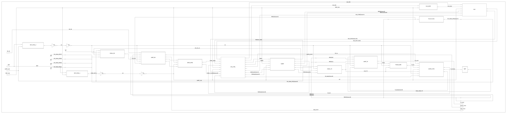
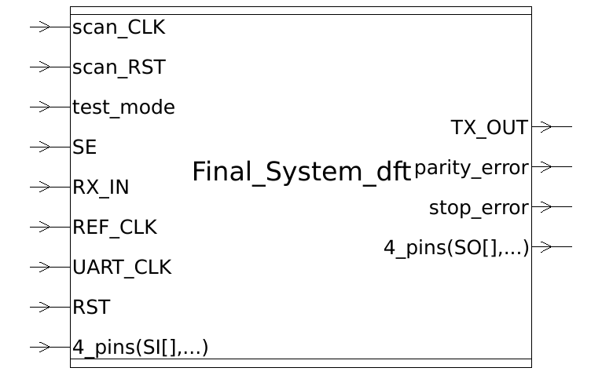

# 🔗 Dual-Clock UART-ALU SoC

<p align="left">
  
  
  
  
  
  
  
  
  
  
</p>

<p align="left">
  
  
</p>

A small SoC that receives commands from a master device over **UART**, executes them using an **ALU** (arithmetic/logic operations) or a **Register File** (read/write), and sends the result back to the master over UART. The design spans **two independent clock domains** bridged by dedicated CDC (Clock Domain Crossing) synchronizers, and is carried in this repository through the full digital ASIC flow — from RTL to synthesis, physical implementation, and final GDSII signoff.

### 🧭 Flow Progress


> 🟢 **Done** — RTL → Functional Verification → Lint → CDC Check → Synthesis → Formal (post-syn) → DFT → Formal (post-dft)   🔵 **Up next** — STA   ⚪ **Pending** — Physical Design → Signoff → GDSII

<details>
<summary><b>📋 Full status write-up (click to expand)</b></summary>
<br>

The full RTL — both clock domains, all CDC synchronizers, the system controller (`SYS_CTRL`), and the top-level integration (`Final_System`) — is in place, and a self-checking ModelSim testbench (`tb/top_tb/`) has passed its full suite end-to-end: RegFile read/write, three ALU operations, and both UART error-injection paths (parity/framing) — **9/9 checks passing**. `Final_System` has been synthesized with Design Compiler against all three `scmetro_tsmc_cl013g` PVT corners with **no constraint violations** (setup slack +265.57 ns, hold slack +0.43 ns). RTL static checks (`lint_reports/`) have also been run with Synopsys SpyGlass; the only reported error and both warnings — the intentional `CLK_GATE.v` ICG latch and the two `ClkDiv.v` generated-clock warnings — have formal, justified waivers on file. A dedicated SpyGlass CDC run formally checked every clock-domain crossing: **14 waivers, all engineering-justified**, and one real issue it surfaced — an unregistered `data_valid` in `FSM_RX.sv` feeding a CDC synchronizer enable — has been fixed. The post-synthesis netlist has been formally verified against the RTL with Synopsys Formality: **382/382 compare points equivalent, 0 failing, 0 unverified, 0 aborted**. Full-scan DFT has been inserted (4 chains, multiplexed flip-flop style, 99.47% estimated stuck-at coverage), and a second Formality run confirms the scan-inserted netlist is still functionally equivalent to the DFT-aware RTL in mission mode: **382/382 compare points equivalent, 0 failing**. STA, physical design, signoff, and GDS will follow.

</details>

### 📚 Table of Contents

- [System Overview](#system-overview)
- [RTL Structure — Clock Domains Explained](#rtl-structure--clock-domains-explained)
- [Verification (`tb/`)](#verification-tb)
- [Lint (`lint_reports/`)](#lint-lint_reports)
- [CDC — Clock Domain Crossing (`CDC/`)](#cdc--clock-domain-crossing-cdc)
- [Synthesis (`synthesis/`)](#synthesis-synthesis)
- [Formal Verification — RTL vs. Post-Synthesis Netlist](#formal-verification--rtl-vs-post-synthesis-netlist-formalitypost-syn)
- [DFT — Scan Insertion (`DFT/`)](#dft--scan-insertion-dft)
- [Formal Verification — Post-DFT Equivalence](#formal-verification--post-dft-equivalence-formalitypost-dft)
- [Technology Library — TSMC13](#technology-library--tsmc13)
- [Status](#status)

## System Overview

| | |
|---|---|
| **Function** | Receive a command frame over UART → decode it in `SYS_CTRL` → execute via `ALU` or `RegFile` → return the result over UART |
| **Reference clock** | `REF_CLK` = 50 MHz |
| **UART clock** | `UART_CLK` = 3.6864 MHz |
| **Clock domains** | 2 (bridged via reset/data synchronizers and an asynchronous FIFO) |
| **Technology** | TSMC 13 (`tsmc13fsg`), Scan Metro standard-cell library (`scmetro_tsmc_cl013g`) |

### Post-Synthesis Schematic



*Gate-level block schematic of `Final_System` as synthesized — every RTL block (`UART_RX`, `UART_TX`, `SYS_CTRL`, `regfile`, `ALU`, `ClkDiv_RX`/`ClkDiv_TX`, `CLK_GATE`, `ASYNC_FIFO`, the reset/data synchronizers, etc.) mapped and connected in the netlist. Click the image to zoom in on any signal.*

### Supported ALU Operations
Addition, Subtraction, Multiplication, Division, AND, OR, NAND, NOR, XOR, XNOR, Compare (A = B), Compare (A > B), Compare (A < B), Shift Right (A >> 1), Shift Left (A << 1)

### Supported Register File Operations
Write and Read. Addresses `0x4`–`0x15` are general-purpose data registers; addresses `0x0`–`0x3` are reserved for UART/ALU configuration (parity, prescale, division ratio) and ALU operands.

### Supported UART Command Frames
| Command | Opcode | Frames |
|---|---|---|
| RegFile Write | `0xAA` | 3 (opcode, data, address) |
| RegFile Read | `0xBB` | 2 (opcode, address) |
| ALU Op with operands | `0xCC` | 4 (opcode, operand A, operand B, ALU function) |
| ALU Op without operands | `0xDD` | 2 (opcode, ALU function) |

Full block interfaces, signal tables, and command-frame formats are documented in [`docs/specs/Final_System.pdf`](docs/specs/Final_System.pdf).

## RTL Structure — Clock Domains Explained

The RTL is organized by **clock domain**, so it's immediately clear which clock drives each block and where domain-crossing logic is required.

```
rtl/
├── clock_domain1/      → Driven by REF_CLK (50 MHz)
│   ├── regfile/            8x16 Register File — holds operands, config, and general data
│   ├── alu/                Executes the arithmetic/logic operations
│   ├── clock_gating/       Gates REF_CLK into the ALU (enabled by SYS_CTRL)
│   └── sys_ctrl/           Main controller — decodes commands, drives RegFile/ALU, talks to UART via the synchronizers
│
├── clock_domain2/      → Driven by UART_CLK (3.6864 MHz)
│   ├── uart_tx/             Serializes result frames out to the master (TX_OUT)
│   ├── uart_rx/             Deserializes incoming command frames from the master (RX_IN)
│   ├── pulse_gen/           Converts UART_TX's Busy (level) signal into a single-cycle pulse
│   └── clock_divider/       Generates the bit-rate clock for TX/RX from UART_CLK (two instances, one per interface)
│
├── sync/                → Clock Domain Crossing (CDC) logic between domain 1 and domain 2
│   ├── rst_sync/             Active-low async reset synchronizer (one instance per domain)
│   ├── data_sync/             Synchronizes UART_RX's parallel output data into the REF_CLK domain
│   └── async_fifo/            Dual-clock FIFO carrying TX data from REF_CLK (write side) to UART_CLK (read side)
│
└── top/                  Top-level integration of both clock domains and all synchronizers
```

**Why two domains?** The core datapath (RegFile + ALU) runs at the fast 50 MHz reference clock for quick command execution, while the UART interface runs at the much slower 3.6864 MHz clock required for standard UART bit timing. The `sync/` blocks are what safely move resets, data, and control pulses between these two asynchronous clocks.

### RegFile (`rtl/clock_domain1/regfile/`)

| File | Role |
|---|---|
| `Register_File.v` | 8-bit × 16-entry register file (`regfile`, parameterized `Address_width`, `Data_width`, `depth`). Single-cycle synchronous read/write (`RdEN`/`WrEn`), with `RdData_Valid` pulsing high the cycle after a read. On reset, all entries clear to 0 except the reserved configuration registers: `Reg_file[2]` (UART config: parity enable/type + prescale) resets to `8'b1000_0001`, and `Reg_file[3]` (clock-divider ratio) resets to `8'b0010_0000` (32). Continuously exposes `REG0`–`REG3` (ALU operand A/B, UART config, division ratio) to their consumer blocks. |

### ALU (`rtl/clock_domain1/alu/`)

| File | Role |
|---|---|
| `ALU.v` | Arithmetic/logic unit (`ALU`, parameterized `OPER_WIDTH`, output width = 2×`OPER_WIDTH`). Registers `ALU_OUT`/`OUT_VALID` on `CLK` when `EN` is asserted, decoding `ALU_FUN` to select the operation: Add, Sub, Mul, Div, AND, OR, NAND, NOR, XOR, XNOR, Compare (A=B), Compare (A>B), Compare (A<B), Shift Right (A>>1), Shift Left (A<<1). Synchronous reset clears the output and valid flag. |

### Clock Gating (`rtl/clock_domain1/clock_gating/`)

| File | Role |
|---|---|
| `CLK_GATE.v` | Integrated clock gating cell (`CLK_GATE`). A level-sensitive latch captures `CLK_EN` while `CLK` is low, and the latched enable is ANDed with `CLK` to produce a glitch-free `GATED_CLK`. This is the standard ICG (Integrated Clock Gating) structure used to gate `REF_CLK` into the ALU, driven by `SYS_CTRL`. A commented-out instantiation of the technology's `TLATNCAX12M` cell is included for mapping to the standard-cell library during synthesis. |

### SYS_CTRL (`rtl/clock_domain1/sys_ctrl/`)

| File | Role |
|---|---|
| `SYS_CTRL.sv` | Main command controller (`SYS_CTRL`, parameterized `OPER_WIDTH`, `ALU_OUT_WIDTH`, `Address_width`). A Moore/Mealy FSM decodes the opcode byte received from UART_RX (`0xAA`/`0xBB`/`0xCC`/`0xDD`) and sequences RegFile writes/reads and ALU operations accordingly, sending the result back out through the TX path once `FIFO_FULL` allows it. Verified against RegFile read/write and three ALU operations in `tb/top_tb/` — see [Latest Simulation Result](#latest-simulation-result-). |

### UART_TX (`rtl/clock_domain2/uart_tx/`)

| File | Role |
|---|---|
| `UART_TX.v` | Top-level UART transmitter — integrates the FSM, MUX, parity, and serializer sub-blocks |
| `FSM_TX.sv` | Transmit control state machine (idle → start → data → parity → stop) |
| `MUX.v` | Selects between data bit, start bit, parity bit, and stop bit for the serial line |
| `Parity_calc.v` | Computes the parity bit for the outgoing frame |
| `serializer.v` | Shifts the parallel input data out bit-by-bit onto `TX_OUT`. Both `ser_data` (the serial output bit) and `ser_done` (end-of-byte flag) are registered on `CLK`, avoiding combinational glitches on the serial line. |

### UART_RX (`rtl/clock_domain2/uart_rx/`)

| File | Role |
|---|---|
| `UART_RX.v` | Top-level UART receiver — integrates the FSM, sampling, and checker sub-blocks |
| `FSM_RX.sv` | Receive control state machine (idle → start → data → parity → stop) |
| `strt_check.v` | Detects and validates the start bit on `RX_IN` |
| `data_sampling.v` | Samples incoming serial bits at the prescaled bit-rate clock |
| `deserializer.v` | Shifts sampled serial bits into a parallel data word |
| `edge_bit_counter.v` | Tracks bit position / oversampling count within each received bit |
| `parity_check.v` | Checks received parity against the configured parity type |
| `stop_check.v` | Validates the stop bit and flags framing errors |

### PULSE_GEN (`rtl/clock_domain2/pulse_gen/`)

| File | Role |
|---|---|
| `PULSE_GEN.v` | Level-to-pulse converter (`PULSE_GEN`). Delays `LVL_SIG` by one clock cycle and generates a single-cycle `PULSE_SIG` on its rising edge (rising-edge detector). Used to turn UART_TX's `Busy` level signal into a one-cycle read-enable pulse for the ASYNC_FIFO. Asynchronous, active-low reset. |

### Clock Divider (`rtl/clock_domain2/clock_divider/`)

| File | Role |
|---|---|
| `ClkDiv.v` | Programmable clock divider (`ClkDiv`). Divides `i_ref_clk` by `i_div_ratio` to produce `o_div_clk`, handling both even and odd division ratios (dual positive/negative-edge counters combined for odd ratios). Passes the reference clock through unchanged when `i_clk_en` is low or the ratio is 0/1. Asynchronous, active-low reset (`i_rst_n`). |
| `Clk_Div_Mux.v` | Prescale-to-division-ratio decoder (`Clk_Div_Mux`). Maps the 6-bit `prescale` configuration value (from RegFile) to the 4-bit `Div_Ratio` fed into `ClkDiv`. |

### RST_SYNC (`rtl/sync/rst_sync/`)

| File | Role |
|---|---|
| `RST_SYNC.v` | Asynchronous-assert, synchronous-release reset synchronizer (`RST_SYNC`, parameterized `NUM_STAGES`). Asserts `SYNC_RST` immediately when `RST` goes low, and releases it synchronously with `CLK` through a multi-flip-flop chain, avoiding metastability on reset de-assertion. One instance is used per clock domain (`RST_SYNC_1` for REF_CLK, `RST_SYNC_2` for UART_CLK). |

### Data_Sync (`rtl/sync/data_sync/`)

| File | Role |
|---|---|
| `Data_Sync.v` | Multi-bit CDC synchronizer (`DATA_SYNC`, parameterized `BUS_WIDTH`/`NUM_STAGES`). Uses a multi-flip-flop synchronizer chain to detect a `bus_enable` pulse on the destination clock (`CLK`), captures `unsync_bus` into `sync_bus` once the pulse is detected, and issues a one-cycle `enable_pulse` marking the new data as valid. Reset is asynchronous, active-low. |

### ASYNC_FIFO (`rtl/sync/async_fifo/`)

| File | Role |
|---|---|
| `ASYNC_FIFO.v` | Top-level dual-clock FIFO (`ASYNC_FIFO`). Integrates the memory, pointer, and Gray-code synchronizer sub-modules below to safely move write-side data (REF_CLK domain) to the read side (UART_CLK domain). |
| `FIFO_MEM_CNTRL.v` | Dual-port memory array. Writes `W_data` on `W_CLK` when enabled and not full; continuously outputs `R_data` from `R_addr`. |
| `FIFO_wptr.v` | Write-pointer logic. Increments the write address on `W_CLK`, converts it to Gray code, and generates the `W_full` flag by comparing against the synchronized read pointer. |
| `FIFO_rptr.v` | Read-pointer logic. Increments the read address on `R_CLK`, converts it to Gray code, and generates the `R_empty` flag by comparing against the synchronized write pointer. |
| `DF_SYNC.v` | Generic multi-bit Gray-code pointer synchronizer (`DF_SYNC`, parameterized `data_width`/`NUM_STAGES`). Used twice inside `ASYNC_FIFO` to cross the write pointer into the read clock domain and vice versa. |

### Top Level (`rtl/top/`)

| File | Role |
|---|---|
| `Final_System.v` | Top-level integration (`Final_System`, parameterized `BUS_WIDTH`, `NUM_STAGES`, `Address_width`, `memory_depth`, `FIFO_depth`). Instantiates both reset synchronizers, `UART_RX`, `Data_Sync`, `SYS_CTRL`, `RegFile`, `ALU`, `Clock Gating`, `ASYNC_FIFO`, `PULSE_GEN`, `Clock Divider`, and `UART_TX`, wiring the full command → execute → response datapath across both clock domains. |
| `NOT.v` | Simple inverter utility module used inside the top-level wiring. |

## Verification (`tb/`)

A self-checking, **ModelSim**-based top-level testbench, driving `Final_System` directly over the UART command protocol and scoring itself against expected results.

```
tb/
└── top_tb/
    ├── system_tb.sv    Self-checking testbench for Final_System
    ├── run.do           ModelSim compile + simulate script
    ├── wave.do           Waveform layout (grouped by UART, DATA_SYNC, SYS_CTRL, ...)
    └── logs/
        └── simulation_log.txt   Transcript from the latest passing ModelSim run
```

**`system_tb.sv`** drives `Final_System` with realistic clocks (`REF_CLK` = 50 MHz, `UART_CLK` = 3.6864 MHz) and a UART-accurate bit period, then exercises:

| Test | Scenario | Checks |
|---|---|---|
| 1 | RegFile Write (`0xAA`) then Read (`0xBB`) at address `0x04` | Read-back data matches what was written |
| 2 | ALU with operands (`0xCC`): `10 + 5` | Result low/high bytes returned over TX match `0x000F` |
| 3 | ALU without operands (`0xDD`): `10 − 5` | Result matches `0x0005` |
| 4 | ALU without operands (`0xDD`): `10 × 5` | Result matches `0x0032` |
| 5 | Corrupted-parity frame injected on `RX_IN` | `parity_error` flag asserts |
| 6 | Corrupted stop-bit frame injected on `RX_IN` | `stop_error` flag asserts |

A running `pass_count` / `fail_count` is printed as each check completes, with a final `TEST SUMMARY` at the end of the run.

**To run:** open ModelSim in `tb/top_tb/`, then:
```tcl
do run.do
```
This compiles all RTL sources, elaborates `system_tb`, loads the `wave.do` waveform layout, and runs the simulation to completion.

### Latest Simulation Result ✅

The full test suite has been run end-to-end on ModelSim with **all 9 checks passing**:

```
TEST SUMMARY: PASSED = 9 | FAILED = 0
>>> SUCCESS: ALL ADVANCED TESTS PASSED SUCCESSFULLY! <<<
```

| # | Check | Result | Time |
|---|---|---|---|
| 1 | RegFile read-back = `0x55` | ✅ PASS | 599,912 ns |
| 2 | ALU ADD (10+5) low byte = `0x0F` | ✅ PASS | 1,094,703 ns |
| 3 | ALU ADD (10+5) high byte = `0x00` | ✅ PASS | 1,198,869 ns |
| 4 | ALU SUB (10−5) low byte = `0x05` | ✅ PASS | 1,502,688 ns |
| 5 | ALU SUB (10−5) high byte = `0x00` | ✅ PASS | 1,606,855 ns |
| 6 | ALU MUL (10×5) low byte = `0x32` | ✅ PASS | 1,910,674 ns |
| 7 | ALU MUL (10×5) high byte = `0x00` | ✅ PASS | 2,014,840 ns |
| 8 | Parity error correctly flagged | ✅ PASS | 2,115,331 ns |
| 9 | Framing (stop-bit) error correctly flagged | ✅ PASS | 2,235,822 ns |

Full transcript: [`tb/top_tb/logs/simulation_log.txt`](tb/top_tb/logs/simulation_log.txt).

> **Note:** the logged run above was captured while `REF_period` was set for a 100 MHz reference clock. `REF_period` has since been corrected to 50 MHz to match the system specification; the pass/fail results are expected to hold (only the clock period scales, not the command sequencing), but the log has not yet been re-captured at 50 MHz. A refreshed `simulation_log.txt` will be committed once the testbench is re-run.

## Lint (`lint_reports/`)

RTL static checks were run with **Synopsys SpyGlass** (`SpyGlass_vL-2016.06`), using the `lint/lint_rtl` goal from the `rtl_handoff` GuideWare methodology. Every reported issue has a formal, justified waiver.

```
lint_reports/
├── lint.prj                        SpyGlass project file — lists every RTL source, lint options, goal setup, and the waiver file to apply
├── moresimple.rpt                   SpyGlass lint report (clock-reset, ERC, latch, lint, morelint, STARC, timing, and related rule groups)
└── spyglass-1_waiver_file.awl       Waiver file with a written engineering justification for each waived message
```

### Result Summary

| Severity | Count | Details | Waived |
|---|---|---|---|
| Error | 1 | `InferLatch` — latch inferred for `Latch_Out` in `CLK_GATE.v` | ✅ |
| Warning | 2 | `STARC05-1.4.3.4 ClkSigToNonClkPin` — `ClkDiv`'s `clk_div` output used as a non-clock signal in both TX and RX clock-divider instances | ✅ |
| Info | 2 | Top-level design unit detection (`Final_System`) and elaboration summary pointer | — (informational) |

> The raw `moresimple.rpt` in this snapshot predates loading the waiver file into the SpyGlass session, so it still lists the error/warnings as reported. `lint.prj` points SpyGlass at `spyglass-1_waiver_file.awl` as its `default_waiver_file`; re-running the goal with the waiver file loaded suppresses all 3 messages below, leaving only the 2 informational messages.

**Waiver 1 — `InferLatch` in `CLK_GATE.v`:** the inferred latch is a deliberate Integrated Clock Gating (ICG) implementation, not an unintended combinational latch. It captures `CLK_EN` while `CLK` is low and holds it stable through the clock's high phase, so `GATED_CLK = CLK && Latch_Out` is generated glitch-free — the standard RTL pattern for clock gating ahead of synthesis mapping onto a technology ICG cell (`TLATNCAX12M`, already referenced in `CLK_GATE.v`). Action required at synthesis: confirm `set_clock_gating_style -positive_edge_logic integrated` correctly maps this construct onto the library ICG cell rather than leaving a literal latch in the netlist.

**Waiver 2 — `STARC05-1.4.3.4` in `ClkDiv.v` (×2, TX and RX instances):** `clk_div` is a generated (internally divided) clock, flagged because it drives clock ports (`CLK_RX`/`CLK_TX`) downstream. Inside the divider module it is legitimately combined through synchronous reset logic and a combinational selector (`clk_en ? div_clk : i_ref_clk`) to implement ratio-based division and the reference-clock bypass path — inherent to how a clock-divider/clock-mux block works, not a design defect. No action required.

Full detail is in [`lint_reports/moresimple.rpt`](lint_reports/moresimple.rpt) (raw report) and [`lint_reports/spyglass-1_waiver_file.awl`](lint_reports/spyglass-1_waiver_file.awl) (waiver justifications).

## CDC — Clock Domain Crossing (`CDC/`)

A dedicated **SpyGlass CDC** run — separate from the `lint_rtl` goal above — formally checks every clock-domain crossing in the design, using the `rtl_handoff` GuideWare methodology's `cdc/cdc_setup_check`, `cdc/clock_reset_integrity`, and `cdc/cdc_verify_struct` goals.

```
CDC/
├── system_cdc.prj                  SpyGlass project file — RTL file list, goal setup, and the waiver file to apply
└── scripts/
    ├── Final_System.sgdc            SGDC constraints: clock/reset definitions, quasi-static signals, synchronizer declarations
    ├── system_waivers.swd            Waiver file — a written engineering justification for every waived message
    └── sdc2sgdc.sgdc.4585            Tool-generated clock summary, translated from the synthesis SDC
```

### Clock domains detected

| Clock | Period | Source |
|---|---|---|
| `REF_CLK` | 20 ns (50 MHz) | Primary input |
| `UART_CLK` | 271.30 ns (~3.69 MHz) | Primary input |
| `Final_System.CLK_GATE.GATED_CLK` (`ALU_CLK`) | 20 ns | Generated — gated `REF_CLK` |
| `Final_System.ClkDiv_TX.o_div_clk` (`TX_CLK`) | 8681.50 ns | Generated — divided `UART_CLK` |
| `Final_System.ClkDiv_RX.o_div_clk` (`RX_CLK`) | 271.30 ns | Generated — divided `UART_CLK` |

### Quasi-static signals

`REG2` and `REG3` (the Register File's UART-config and clock-divider-ratio registers — the same registers `i_clk_en`/`i_div_ratio` come from) are declared `quasi_static`: they change only during configuration, not while the clock they configure is actively toggling, so their downstream clock-mux/divider convergence is analyzed as glitch-safe rather than flagged as a live hazard. `set_case_analysis` was deliberately **not** used here, since these registers do change (at configuration time) rather than being permanently tied to one value — `set_case_analysis` would have hidden a real, reachable path from analysis instead of correctly modeling it as slow-changing.

### Result — 14 waivers, all formally justified ✅

| Rule | Waived | What it flags | Why it's safe |
|---|---|---|---|
| `Setup_port01` | 1 | `RST` port not fully constrained at top level | Drives dedicated reset synchronizers (`RST_SYNC`) immediately |
| `Clock_check04` | 1 | `negedge UART_CLK` used against recommended edge | Intentional — needed for 50% duty cycle in the odd-ratio clock divider |
| `Clock_converge01` | 1 | `UART_CLK` fan-out reconverges on `CLK_RX` | Intentional reconvergence via OR gate in the odd-divider architecture (bypass path + divided path) |
| `Clock_glitch04` | 2 | Divider logic (`clk_div`/`clk_odd_div`) reconverges on destination registers (`R_addr`, `current_state`) | Structural artifact of the same posedge/negedge OR-gate divider, present in both TX and RX instances |
| `Ac_conv02` | 2 | Synchronized Gray pointers (`DF_SYNC_W`/`DF_SYNC_R`) converge on a combinational gate (`W_full`/`R_empty`) | Standard, safe pattern for evaluating async-FIFO full/empty flags from synchronized Gray pointers |
| `Ac_conv04` | 1 | FIFO memory bus converges into the UART TX serializer's shift register | Protected by `R_empty` read-handshaking, so Gray-encoding isn't required on the data bus itself |
| `Ac_conv01` | 1 | `DATA_SYNC` and FIFO `DF_SYNC_W` converge on a MUX feeding `SYS_CTRL.next_state` | Safe — the two synchronized sources are evaluated in mutually exclusive FSM states |
| `Ac_cdc01a` | 1 | Fast-to-slow crossing for the FIFO's Gray write pointer into `DF_SYNC_R` | Gray coding guarantees no intermediate/invalid states are sampled across the crossing |
| `Ac_datahold01a` | 2 | FIFO read-payload crossing into `Parity_calc`/`serializer` not independently data-hold-checked | Structurally protected by the FIFO's read-empty handshaking |
| `Ac_clockperiod03` | 1 | `UART_CLK`/`REF_CLK` period ratio exceeds the default threshold | Expected and safe — the two clocks are fully asynchronous, decoupled via FIFOs and synchronizers, not a ratio-dependent design |

Full justifications are in [`CDC/scripts/system_waivers.swd`](CDC/scripts/system_waivers.swd).

### Fix landed from this CDC pass — `FSM_RX.sv`: registering `data_valid`

The CDC run's `Ac_datahold01a`-style analysis around `UART_RX`'s handoff to `DATA_SYNC` surfaced a real issue (not a false positive to waive): `data_valid` in `FSM_RX.sv` was driven directly out of the FSM's combinational next-state/output block, then used, unregistered, as `DATA_SYNC`'s `bus_enable` — the enable that qualifies a CDC synchronizer sampled on `REF_CLK`. A combinational signal feeding a synchronizer enable can glitch mid-cycle and be sampled incorrectly on the other side of the clock boundary.

**Fix:** `data_valid` is now a clean, clocked flip-flop output. The combinational logic still computes the value (renamed `data_valid_comb`), but it's registered on `posedge CLK` (asynchronous `RST`) before leaving the module, giving `DATA_SYNC` a single, clock-aligned pulse to synchronize instead of a combinational signal.

## Synthesis (`synthesis/`)

`Final_System` has been synthesized with **Synopsys Design Compiler** (`O-2018.06-SP1`) against all three `scmetro_tsmc_cl013g` PVT corners, using multi-corner timing (worst-case `ss_1p08v_125c` for setup, best-case `ff_1p32v_m40c` for hold).

```
synthesis/
├── scripts/
│   ├── syn_script.tcl    Design Compiler synthesis script (libraries, RTL elaboration, constraints, mapping, reporting)
│   ├── cons.tcl           Timing/design constraints applied before mapping
│   ├── system.lst          List of RTL source files read into the synthesis session
│   └── run_syn.sh          Shell wrapper to launch the synthesis run
├── sdc/
│   └── Final_System.sdc    Synthesis-derived SDC: clocks, uncertainty, I/O delays, clock groups
├── netlist/
│   ├── Final_System.v       Gate-level structural netlist
│   └── Final_System.ddc     Compiled Design Compiler database (netlist + constraints)
├── sdf/
│   └── Final_System.sdf     Standard Delay Format — back-annotated cell/net delays for gate-level simulation
├── svf/
│   └── Final_System.svf     Setup Verification File for Formality (RTL-vs-netlist equivalence checking)
├── log/
│   └── syn.log               Full synthesis session transcript
└── reports/
    ├── area.rpt               Cell/area breakdown, by hierarchy
    ├── power.rpt               Power breakdown, by hierarchy
    ├── setup.rpt               Worst setup (max-delay) timing path
    ├── hold.rpt                 Worst hold (min-delay) timing path
    ├── clocks.rpt                Clock tree summary (real + generated clocks)
    └── constraints.rpt            Constraint-violation summary
```

### Clock Tree

Design Compiler derived 3 generated clocks from the two real (unconstrained) input clocks, matching the RTL's clock-gating and clock-dividing structure:

| Clock | Period | Source | Divide |
|---|---|---|---|
| `REF_CLK` | 20.00 ns (50 MHz) | Primary input | — |
| `ALU_CLK` | 20.00 ns (50 MHz) | `CLK_GATE/GATED_CLK` (generated from `REF_CLK`) | ÷1 |
| `UART_CLK` | 271.30 ns (3.6864 MHz) | Primary input | — |
| `RX_CLK` | 271.30 ns | `ClkDiv_RX/o_div_clk` (generated from `UART_CLK`) | ÷1 |
| `TX_CLK` | 8,681.50 ns | `ClkDiv_TX/o_div_clk` (generated from `UART_CLK`) | ÷32 |

`REF_CLK`/`ALU_CLK` and `UART_CLK`/`TX_CLK`/`RX_CLK` are constrained as asynchronous clock groups, consistent with the CDC synchronizers in `rtl/sync/`.

### Timing — Constraints Met ✅

```
This design has no violated constraints.
```

| Check | Corner | Worst Path | Slack | Result |
|---|---|---|---|---|
| Setup (max delay) | `ss_1p08v_125c` (worst-case) | `regfile → ALU` (`ALU_CLK`) | **+265.57 ns** | ✅ MET |
| Hold (min delay) | `ff_1p32v_m40c` (best-case) | `RST_SYNC_2 → ...` (`UART_CLK`) | **+0.43 ns** | ✅ MET |

### Area & Power

| Metric | Value |
|---|---|
| Total cell area | 24,877.79 µm² |
| Total area (incl. net interconnect) | 294,752.49 µm² |
| Cell count | 2,191 (1,735 combinational, 414 sequential) |
| Total power (`ss_1p08v_125c`) | 0.255 mW |

By hierarchy, the largest power contributors are `regfile` (42.7%), `ASYNC_FIFO` (26.7%), and `ALU` (6.9%) — dominated by leakage at this analysis effort (`-analysis_effort low`), so these figures should be treated as a first-pass estimate rather than a signoff-quality power number.

### Synthesis Log

`syn.log` reports **0 errors, 45 warnings**. All warnings are benign/expected for this design stage — mainly unused/dangling internal signals flagged by lint-style checks (e.g. floating counter bits in `edge_bit_counter`, an unconnected `prescale[0]` bit in `data_sampling`), plus the standard `SYNOPSYS_UNCONNECTED_*` net-naming note from the Verilog netlist writer. None affect functionality or timing closure.

## Formal Verification — RTL vs. Post-Synthesis Netlist (`Formality/post-syn/`)

The gate-level netlist produced by Design Compiler is proven logically equivalent to the RTL using **Synopsys Formality** (`L-2016.03-SP1`), consuming the SVF (Setup Verification File) that Design Compiler wrote out during synthesis (`synthesis/svf/Final_System.svf`) so that the reference-to-implementation mapping matches what the synthesis tool actually did.

```
Formality/
└── post-syn/
    ├── scripts/
    │   ├── syn_fm_script.tcl   Formality session: reads RTL (Ref) + netlist (Imp), reads the SVF, matches, verifies
    │   └── run_syn_fm.sh        Shell wrapper to launch fm_shell in batch mode
    ├── logs/
    │   └── syn_fm.log            Full Formality session transcript
    ├── formality_svf/
    │   └── svf.txt                 Copy of the consumed SVF, for traceability
    └── reports/
        ├── passing_points.rpt      Matched, logically-equivalent compare points
        ├── failing_points.rpt        Not-equivalent compare points
        ├── unverified_points.rpt      Compare points Formality could not resolve
        └── aborted_points.rpt          Compare points dropped from analysis
```

### Result — Verification SUCCEEDED ✅

| Compare Points | Port | DFF | LAT | Total |
|---|---|---|---|---|
| Passing (equivalent) | 3 | 378 | 1 | **382** |
| Failing (not equivalent) | 0 | 0 | 0 | **0** |
| Unverified | — | — | — | **0** |
| Aborted | — | — | — | **0** |

Formality ran in **Synopsys Auto Setup** mode (`synopsys_auto_setup = true`), matching the RTL-interpretation and undriven-signal settings Design Compiler itself uses, so the equivalence check is apples-to-apples with how the netlist was actually synthesized. One `FMR_ELAB-147` message was produced while linking the reference (RTL) design — an interpretation note, not an equivalence failure — and does not appear against any of the 382 matched points. (Re-run after the `FSM_RX.sv` `data_valid` register fix — see [CDC](#cdc--clock-domain-crossing-cdc) — which added one DFF, hence 382 vs. the earlier 381.)

Full detail is in [`Formality/post-syn/logs/syn_fm.log`](Formality/post-syn/logs/syn_fm.log) (session transcript) and the individual `reports/*.rpt` files.

## DFT — Scan Insertion (`DFT/`)

Design-for-Test is added to `Final_System_dft` (the post-synthesis netlist re-targeted with test-friendly RTL) using Design Compiler's scan architecting flow: full-scan, multiplexed-flip-flop style, with a single external scan-enable (`SE`) and no scan compression.

```
DFT/
├── scripts/
│   ├── dft_script.tcl          DC session: elaborate → constrain → scan-configure → insert_dft → post-DFT optimize/report
│   ├── cons.tcl                   Timing/design constraints re-applied for the DFT build
│   ├── run_dft.sh                  Shell wrapper to launch dc_shell in batch mode
│   └── system.lst                    RTL file list (DFT-friendly variants)
├── log/
│   └── dft.log                        Full DC session transcript
├── dft_drc_post_dft/
│   └── dft_drc_post_dft.rpt              Post-DFT design-rule check + estimated fault coverage
├── netlists/
│   └── Final_System_dft.v                  Scan-inserted gate-level netlist
├── reports/                                  area / power / timing / clocks / ports / constraints
├── sdc/  and  sdf/                              Post-DFT constraints and delay annotation
└── svf/
    └── Final_System_dft.svf                Setup file for a follow-up Formality equivalence check
```

### Block Diagram — `Final_System_dft` Top-Level Ports



*Top-level symbol for the DFT-inserted design, showing the functional ports (`RX_IN`, `REF_CLK`, `UART_CLK`, `RST`, `TX_OUT`, `parity_error`, `stop_error`) alongside the scan/test ports added for DFT (`scan_CLK`, `scan_RST`, `test_mode`, `SE`, and the 4-bit `SI[]`/`SO[]` scan chain buses).*

### RTL made test-friendly

Two blocks needed a DFT-aware variant, added alongside the originals rather than replacing them:

- **`CLK_GATE_dft.v`** — adds a `TE` (test-enable) input, ORed with `CLK_EN`, so the integrated clock-gating latch is forced transparent in test mode instead of gating the scan clock.
- **`ClkDiv_dft.v`** — splits the divider's single dual-edge-triggered clock (`i_ref_clk`, used on both `posedge` and `negedge`) into two separate ports, `i_ref_clk_pos` and `i_ref_clk_neg`. ATPG tools can't drive a single physical clock pin on both edges during scan shift, so the two edges are exposed as independent inputs and merged back in test glue logic (`MUX2x1.v`) — a new top-level variant, `Final_System_dft.v` (`rtl/top__dft/`), wires this all together and adds the scan/test ports (`scan_CLK`, `scan_RST`, `test_mode`, `SE`, `SI[3:0]`, `SO[3:0]`).

### Result — 4 scan chains, 99.47% estimated coverage, timing clean ✅

| | |
|---|---|
| Scan methodology | Full scan, multiplexed flip-flop |
| Chains | **4**, ~94–95 cells each, 378 scan cells total |
| Post-DFT DRC | **1** violation — `CLK_GATE` ICG latch reports constant-1 (expected; same cell already waived in [Lint](#lint-lint_reports)) |
| Estimated stuck-at coverage | **99.47%** (17,414 detected / 18,266 total faults; 758 undetectable, 79 ATPG-untestable, 14 not detected) |
| Post-DFT timing | All paths **MET** — worst setup slack +0.09 ns, worst hold slack +0.40 ns |

The coverage figure comes from `dft_drc -coverage_estimate`, a Design-Compiler estimate ahead of a dedicated ATPG signoff run (TetraMAX or equivalent) — see the note in [`dft_drc_post_dft.rpt`](DFT/dft_drc_post_dft/dft_drc_post_dft.rpt). Full detail is in [`DFT/log/dft.log`](DFT/log/dft.log).

## Formal Verification — Post-DFT Equivalence (`Formality/post-dft/`)

A second Formality run confirms that inserting the scan chains did not change the design's **mission-mode functional behavior**. This time the comparison is entirely RTL-side vs. netlist-side of the *DFT* boundary:

| | |
|---|---|
| Reference (Ref) | The DFT-aware RTL — `Final_System_dft.v` plus its test-friendly sub-blocks (`CLK_GATE_dft.v`, `ClkDiv_dft.v`, `MUX2x1.v`) |
| Implementation (Imp) | The scan-inserted gate-level netlist, `DFT/netlists/Final_System_dft.v` |
| Test mode during compare | `test_mode = 0`, `SE = 0` — i.e. the chip's **normal operating mode**, not scan-shift mode |
| Excluded from comparison | `SI[]` / `SO[]` scan ports (they don't exist as functional ports in the RTL) |

```
Formality/
└── post-dft/
    ├── scripts/
    │   ├── dft_fm_script.tcl   Formality session: reads DFT-aware RTL (Ref) + scan-inserted netlist (Imp), matches, verifies
    │   └── run_dft_fm.sh        Shell wrapper to launch fm_shell in batch mode
    ├── logs/
    │   └── dft_fm_log.log        Full Formality session transcript
    └── reports/
        ├── passing_points.rpt      Matched, logically-equivalent compare points
        ├── failing_points.rpt        Not-equivalent compare points
        ├── unverified_points.rpt      Compare points Formality could not resolve
        └── aborted_points.rpt          Compare points dropped from analysis
```

### Result — Verification SUCCEEDED ✅

| Compare Points | Port | DFF | LAT | Total |
|---|---|---|---|---|
| Passing (equivalent) | 3 | 378 | 1 | **382** |
| Failing (not equivalent) | 0 | 0 | 0 | **0** |
| Unverified | — | — | — | **0** |
| Aborted | — | — | — | **0** |

Same compare-point count and breakdown as the post-syn check (382 = 3 ports, 378 flip-flops, 1 latch) — expected, since scan insertion re-wires existing sequential cells through a scan mux rather than adding or removing functional registers. Formality ran with `synopsys_auto_setup = true`, and the design is set constant at `test_mode = 0` / `SE = 0` so the comparison exercises the functional datapath, not the scan path.

Full detail is in [`Formality/post-dft/logs/dft_fm_log.log`](Formality/post-dft/logs/dft_fm_log.log) (session transcript) and the individual `reports/*.rpt` files.

## Technology Library — TSMC13

The `lib/` directory holds the foundry/standard-cell library files needed for synthesis, STA, and physical implementation, organized by file type:

```
lib/
├── captables/     Parasitic capacitance table for extraction
├── lef/           Technology + macro LEF files
├── libs/          Timing libraries for the scmetro_tsmc_cl013g standard-cell library
│   ├── db/          Compiled .db files
│   └── lib/          Liberty (.lib) source files
└── models/        Verilog simulation models for the standard-cell library
```

Three PVT (Process/Voltage/Temperature) corners are provided for the standard-cell library:

| Corner | Voltage / Temp | Purpose |
|---|---|---|
| `ff_1p32v_m40c` | Fast, 1.32V, −40°C | Best-case timing (hold analysis) |
| `tt_1p2v_25c` | Typical, 1.2V, 25°C | Nominal / functional signoff |
| `ss_1p08v_125c` | Slow, 1.08V, 125°C | Worst-case timing (setup analysis) |

## Status

| Stage | Result | Detail |
|---|---|---|
| ✅ RTL & Functional Verification | 9/9 checks passing | [Verification](#verification-tb) |
| ✅ Lint | 3/3 issues waived | [Lint](#lint-lint_reports) |
| ✅ CDC Check | 14 waivers, all justified | [CDC](#cdc--clock-domain-crossing-cdc) |
| ✅ Synthesis | 0 constraint violations, all 3 PVT corners | [Synthesis](#synthesis-synthesis) |
| ✅ Formal (post-syn) | 382/382 passing, 0 failing | [Formal Verification](#formal-verification--rtl-vs-post-synthesis-netlist-formalitypost-syn) |
| ✅ DFT | 4 chains, 99.47% est. coverage, timing clean | [DFT](#dft--scan-insertion-dft) |
| ✅ Formal (post-dft) | 382/382 passing, 0 failing | [Formal Verification — Post-DFT](#formal-verification--post-dft-equivalence-formalitypost-dft) |
| 🔵 STA | Up next | — |
| ⚪ Physical Design | Pending | — |
| ⚪ Signoff & GDSII | Pending | — |

**In short:** all RTL blocks are in place and pass the full self-checking testbench (9/9 checks). A SpyGlass lint pass has all 3 reported issues formally waived, and a dedicated SpyGlass CDC run formally checked every clock-domain crossing — **14 waivers, all engineering-justified**, plus a real fix landed (`FSM_RX.sv` now registers `data_valid` before it drives a synchronizer enable). `Final_System` has been synthesized against all three PVT corners with **zero constraint violations** (setup slack +265.57 ns at `ss_1p08v_125c`, hold slack +0.43 ns at `ff_1p32v_m40c`). Synopsys Formality confirms the gate-level netlist is logically equivalent to the RTL (**382/382 compare points, 0 failing**). Full-scan DFT has been inserted (4 chains, multiplexed flip-flop style, **99.47% estimated stuck-at coverage**, all post-DFT timing paths met), and a second Formality run confirms the scan-inserted netlist is still functionally equivalent to the DFT-aware RTL in mission mode (**382/382 compare points, 0 failing**). Next up: a dedicated ATPG signoff run, full STA, physical design (floorplan → place → CTS → route), signoff, and GDSII.
